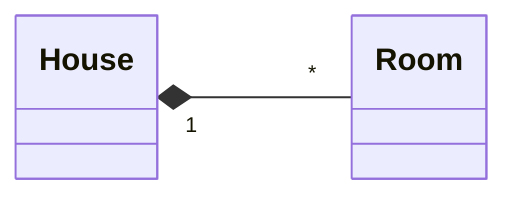
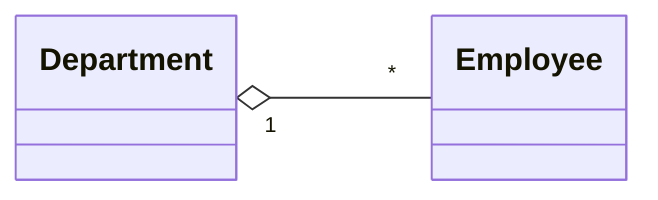
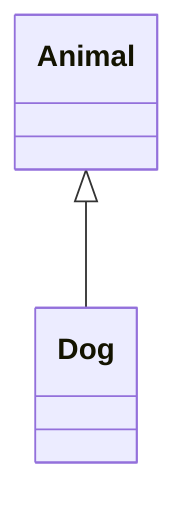
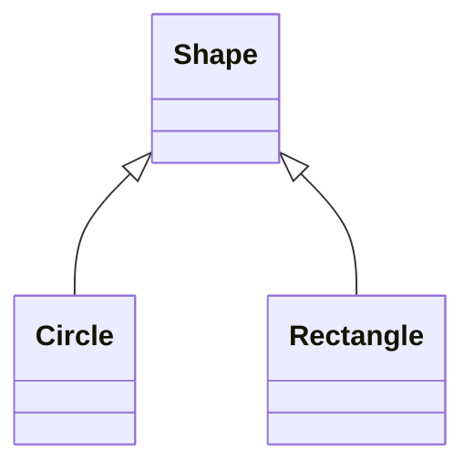
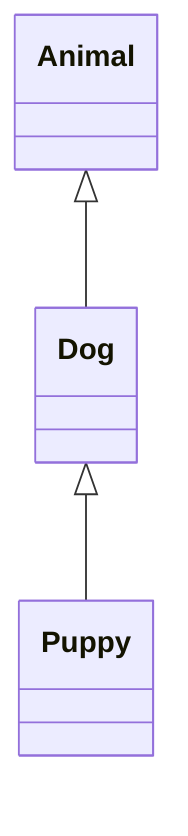
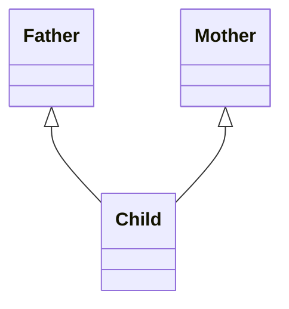

# Python Basic Guide

&nbsp;[Bidur Sapkota](https://www.bidursapkota.com.np/)


## Table of Contents

1. [Introduction to Python Programming](#1-introduction-to-python-programming)
2. [Basic Programming in Python](#2-basic-programming-in-python)
3. [Advanced Data Types and Operation in Python](#3-advanced-data-types-and-operation-in-python)
4. [Object Oriented Programming](#4-object-oriented-programming)
5. [Exceptions and File Handling in Python](#5-exceptions-and-file-handling-in-python)
6. [Python Libraries and Maths](#6-python-libraries-and-maths)

---

## 1: Introduction to Python Programming

Python is a high-level, interpreted, dynamically typed, general-purpose programming language known for its simple and readable syntax. It is widely used for web development, data science, artificial intelligence, automation, and more.

## 1.1 Need of Python

Python addresses several shortcomings of older languages:

**Rapid Development:** Python's concise syntax allows developers to write programs much faster than in C/C++ or Java. A task requiring 20 lines in Java may take 5 lines in Python.

**Readability:** Python enforces clean indentation-based structure, making code inherently readable and maintainable.

**Versatility:** A single language usable for web development, data science, AI/ML, automation, scripting, scientific computing, and more. This reduces the need to learn multiple specialized languages.

**Beginner-Friendly:** Low barrier to entry makes it ideal for teaching programming and for non-programmers (scientists, analysts) who need to code.

**Rich Ecosystem:** Massive collection of third-party libraries and frameworks (NumPy, Django, TensorFlow, Pandas) means developers rarely need to build from scratch.

**Community Support:** One of the largest and most active programming communities, ensuring abundant documentation, tutorials, and help.

## 1.2 Features, Limitations and Applications of Python

### Features

1. **Beginner-Friendly:** It is simple and easy to learn. It uses English-like syntax with minimal boilerplate. Uses indentation instead of braces for blocks.
2. **Interpreted Language:** Code is executed line by line by the Python interpreter, enabling interactive testing and rapid prototyping. No separate compilation step needed.
3. **High-Level Language:** Abstracts away low-level details like memory management, hardware interaction, etc.
4. **Dynamically Typed:** Variable types are determined at runtime. There is no need for explicit type declarations (`x = 10` automatically makes `x` an integer).
5. **Multi-Paradigm:** Supports procedural, object-oriented, and functional programming styles within a single language.
6. **Platform Independent (Portable):** Python code runs on Windows, Linux, macOS, etc., without modification. "Write once, run anywhere."
7. **Open Source and Free:** Freely available under the PSF license. Anyone can download, use, modify, and distribute it.
8. **Embeddable and Extensible:** Python can be embedded within C/C++ programs, and C/C++ code can be called from Python for performance-critical tasks.
9. **Automatic Memory Management:** Uses garbage collection (reference counting + cyclic garbage collector) to handle memory automatically.
10. **Large Community and Ecosystem:** Thousands of third-party packages available via PyPI (pip).

### Limitations

1. **Slower Execution Speed:** Being interpreted and dynamically typed, Python is significantly slower than compiled languages (C, C++, Java) for computation-heavy tasks.
2. **Not Ideal for Mobile Development:** Python is not natively used for mobile app development (Android/iOS). Frameworks like Kivy exist but are not mainstream.
3. **High Memory Consumption:** Python objects carry overhead, leading to higher memory usage compared to C/C++.
4. **Global Interpreter Lock (GIL):** The GIL in CPython prevents true parallel execution of multiple threads on multi-core processors, limiting CPU-bound multi-threaded performance.
5. **Runtime Errors:** Dynamic typing means type-related errors are caught only at runtime, not at compile time.
6. **Not Suitable for Low-Level Programming:** Cannot be used for OS kernels, device drivers, or embedded systems requiring direct hardware control (unlike C/C++).

### Application Areas of Python

**Web Development:** Django, Flask, FastAPI

**Data Science & Analytics:** NumPy, Pandas, Matplotlib

**Machine Learning & AI:** TensorFlow, PyTorch, Scikit-learn

**Automation & Scripting:** Task automation, file handling, web scraping (Selenium, BeautifulSoup)

**Scientific Computing:** SciPy, SymPy

**Desktop GUI Applications:** Tkinter, PyQt, Kivy

**Game Development:** Pygame

**Network Programming:** Socket programming, Twisted

---

## 2: Basic Programming in Python

## 2.1 Keywords

Keywords are reserved words in Python that have predefined meanings and cannot be used as variable names, function names, or identifiers. They are case-sensitive. Python 3 has 35 keywords:

```text
False      None       True       and        as
assert     async      await      break      class
continue   def        del        elif       else
except     finally    for        from       global
if         import     in         is         lambda
nonlocal   not        or         pass       raise
return     try        while      with       yield
```

You can list all keywords programmatically:

```python
import keyword
print(keyword.kwlist)
print(len(keyword.kwlist))  # 35
```

**Soft keywords** (e.g., `case`, `_` inside `match` statements) are reserved only in specific contexts and can be used as identifiers elsewhere.

## 2.2 Basic Data Types

Python is dynamically typed. Variable types are determined at runtime, and no explicit type declaration is needed.

### Numeric Types

- **`int`**: Whole numbers, positive or negative, with no size limit (arbitrary precision). Example: `x = 42`
- **`float`**: Numbers with a decimal point, represented with double precision (64-bit IEEE 754). Example: `pi = 3.14`
- **`complex`**: Numbers with a real and imaginary part, written with a `j` suffix. Example: `z = 3 + 5j`. Access parts with `z.real` and `z.imag`.

### Text Type

- **`str`**: Sequence of Unicode characters, enclosed in single (`'...'`), double (`"..."`), or triple quotes (`'''...'''` / `"""..."""`). Strings are immutable. Example: `name = "Python"`

### Boolean Type

- **`bool`**: Has only two values: `True` and `False`. `bool` is a subclass of `int` (`True == 1`, `False == 0`). Used in conditional and logical expressions.

### None Type

- **`NoneType`**: Has a single value: `None`. Represents the absence of a value. Commonly used as a default return value of functions and for initializing variables.

### Type Checking and Conversion

```python
x = 10
print(type(x))           # <class 'int'>
print(isinstance(x, int)) # True
```

**Implicit conversion** (coercion): Python automatically converts smaller types to larger types during operations to prevent data loss:

```python
result = 10 + 3.5   # int + float → float (13.5)
```

**Explicit conversion** (casting): The programmer manually converts using built-in functions:

```python
int("25")      # 25 (string → int)
int(3.99)      # 3  (float → int, truncates decimal)
float(10)      # 10.0
str(100)       # "100"
bool(0)        # False
bool("hello")  # True (non-empty string)
```

## 2.3 Variables and Inputs

### Variables

A variable is a name that refers to a value stored in memory. Python uses dynamic typing. The type is inferred from the assigned value. No declaration keyword is needed.

```python
x = 10          # int
name = "Alice"  # str
pi = 3.14       # float
```

**Naming rules:**

- Must start with a letter (a–z, A–Z) or underscore (`_`).
- Can contain letters, digits (0–9), and underscores.
- Cannot be a keyword.
- Case-sensitive (`age` and `Age` are different variables).

**Multiple assignment:**

```python
a, b, c = 1, 2, 3       # assign different values
x = y = z = 0            # assign same value
a, b = b, a              # swap values
```

### User Input

The `input()` function reads input from the user as a string. You must explicitly convert it for numeric use.

```python
name = input("Enter your name: ")        # returns str
age = int(input("Enter your age: "))      # convert to int
height = float(input("Enter height: "))   # convert to float
```

### Output

The `print()` function outputs data to the console.

```python
print("Hello", name)                # space-separated by default
print("Age", age, sep=": ")        # custom separator
print("Line1", end="")              # suppress newline
print(f"Name: {name}, Age: {age}")  # f-string formatting
```

## 2.4 Logic and Comparison Operations

An operator is a special symbol or keyword that performs an operation on one or more operands (values/variables). Python supports seven types of operators:

### Arithmetic Operators

| Operator | Description      | Example  | Result  |
| -------- | ---------------- | -------- | ------- |
| `+`      | Addition         | `7 + 3`  | `10`    |
| `-`      | Subtraction      | `7 - 3`  | `4`     |
| `*`      | Multiplication   | `7 * 3`  | `21`    |
| `/`      | Division (float) | `7 / 3`  | `2.333` |
| `//`     | Floor division   | `7 // 3` | `2`     |
| `%`      | Modulus          | `7 % 3`  | `1`     |
| `**`     | Exponentiation   | `2 ** 3` | `8`     |

### Comparison (Relational) Operators

Return `True` or `False`.

| Operator | Meaning               | Example           |
| -------- | --------------------- | ----------------- |
| `==`     | Equal to              | `5 == 5` → `True` |
| `!=`     | Not equal to          | `5 != 3` → `True` |
| `>`      | Greater than          | `5 > 3` → `True`  |
| `<`      | Less than             | `3 < 5` → `True`  |
| `>=`     | Greater than or equal | `5 >= 5` → `True` |
| `<=`     | Less than or equal    | `3 <= 5` → `True` |

### Logical Operators

| Operator | Description                          | Example                    |
| -------- | ------------------------------------ | -------------------------- |
| `and`    | True if both operands are true       | `True and False` → `False` |
| `or`     | True if at least one operand is true | `True or False` → `True`   |
| `not`    | Reverses the boolean value           | `not True` → `False`       |

### Bitwise Operators

Operate on integers at the binary level.

| Operator | Description | Example                         |
| -------- | ----------- | ------------------------------- |
| `&`      | AND         | `5 & 3` → `1`                   |
| \|       | OR          | `5 \| 3` → `7`                  |
| `^`      | XOR         | `5 ^ 3` → `6`                   |
| `~`      | NOT         | `~5` → `-6`. Use `x = -(x + 1)` |
| `<<`     | Left shift  | `5 << 1` → `10`                 |
| `>>`     | Right shift | `5 >> 1` → `2`                  |

### Assignment Operators

| Operator | Equivalent   | Example   |
| -------- | ------------ | --------- |
| `=`      | Assign       | `x = 5`   |
| `+=`     | `x = x + y`  | `x += 3`  |
| `-=`     | `x = x - y`  | `x -= 3`  |
| `*=`     | `x = x * y`  | `x *= 3`  |
| `/=`     | `x = x / y`  | `x /= 3`  |
| `//=`    | `x = x // y` | `x //= 3` |
| `%=`     | `x = x % y`  | `x %= 3`  |
| `**=`    | `x = x ** y` | `x **= 3` |

### Identity Operators

Compare memory locations (whether two variables reference the same object).

- `is`: Returns `True` if both point to the same object. Example: `x is y`
- `is not`: Returns `True` if they point to different objects. Example: `x is not y`

```python
a = [1, 2]
b = a          # b references same object
c = [1, 2]     # c is a different object with same value
print(a is b)      # True
print(a is c)      # False
print(a == c)      # True (values are equal)
```

### Membership Operators

Test if a value exists in a sequence (string, list, tuple, set, dict).

- `in`: Returns `True` if value is found. Example: `3 in [1, 2, 3]` → `True`
- `not in`: Returns `True` if value is not found. Example: `4 not in [1, 2, 3]` → `True`

### Operator Precedence (highest to lowest)

| Precedence      | Operator(s)                                                      | Description                                       |
| :-------------- | :--------------------------------------------------------------- | :------------------------------------------------ |
| **1 (Highest)** | `**`                                                             | Exponentiation (Power)                            |
| **2**           | `~`, `+`, `-`                                                    | Bitwise NOT, Unary Plus, Unary Minus              |
| **3**           | `*`, `/`, `//`, `%`                                              | Multiplication, Division, Floor Division, Modulus |
| **4**           | `+`, `-`                                                         | Addition, Subtraction                             |
| **5**           | `<<`, `>>`                                                       | Bitwise Left and Right Shifts                     |
| **6**           | `&`                                                              | Bitwise AND                                       |
| **7**           | `^`                                                              | Bitwise XOR                                       |
| **8**           | \|                                                               | Bitwise OR                                        |
| **9**           | `==`, `!=`, `<`, `>`, `<=`, `>=`, `is`, `is not`, `in`, `not in` | Comparisons, Identity, Membership                 |
| **10**          | `not`                                                            | Logical NOT                                       |
| **11**          | `and`                                                            | Logical AND                                       |
| **12 (Lowest)** | `or`                                                             | Logical OR                                        |

**Note:** Operators on the same line have the same precedence and are evaluated from left to right (except for exponentiation, which is right-to-left).

## 2.5 Conditional Statements

Conditional statements control the flow of execution based on boolean conditions.

### `if` Statement

```python
x = 10
if x > 0:
    print("Positive")
```

### `if-else` Statement

```python
x = -5
if x >= 0:
    print("Non-negative")
else:
    print("Negative")
```

### `if-elif-else` Statement

```python
marks = 75
if marks >= 90:
    print("A")
elif marks >= 80:
    print("B")
elif marks >= 70:
    print("C")
else:
    print("F")
```

### Nested `if`

```python
x = 10
if x > 0:
    if x % 2 == 0:
        print("Positive and Even")
    else:
        print("Positive and Odd")
else:
    print("Please enter positive number")
```

### Ternary (Conditional) Expression

```python
result = "Even" if x % 2 == 0 else "Odd"
```

### `match-case` (Python 3.10+)

This is the closest thing to a switch statement in Python.

```py
day = 3

match day:
    case 1:
        print("Monday")
    case 2:
        print("Tuesday")
    case 3:
        print("Wednesday")
    case 4:
        print("Thursday")
    case _:
        print("Invalid day")
```

`match` = switch  
`case` = case  
`_` = default case (like default in C/Java)

### With conditions inside cases:

```py
x = 10

match x:
    case n if n < 0:
        print("Negative")
    case 0:
        print("Zero")
    case n if n > 0:
        print("Positive")
```

### Dictionary-based switch (older)

```py
switch = {
    1: "Monday",
    2: "Tuesday"
}

day = 1
print(switch.get(day, "Invalid"))
```

**Example: Positive, Negative or Zero check:**

```python
num = float(input("Enter a number: "))
if num > 0:
    print("Positive")
elif num < 0:
    print("Negative")
else:
    print("Zero")
```

**Example: Simple calculator using conditionals:**

```python
a = float(input("Enter first number: "))
b = float(input("Enter second number: "))
op = input("Enter operator (+, -, *, /): ")

if op == '+':
    print("Result:", a + b)
elif op == '-':
    print("Result:", a - b)
elif op == '*':
    print("Result:", a * b)
elif op == '/':
    if b == 0:
        print("Error: Division by zero!")
    else:
        print("Result:", a / b)
else:
    print("Invalid operator")
```

## 2.6 Loops

Loops execute a block of code repeatedly until a condition is met.

### `for` Loop

Iterates over a sequence (list, tuple, string, range, etc.).

```python
for i in range(1, 6):    # 1, 2, 3, 4, 5
    print(i)

for char in "Python":
    print(char)

for item in [10, 20, 30]:
    print(item)
```

**`range()` function:** `range(start, stop, step)` generates a sequence of integers from `start` (inclusive) to `stop` (exclusive) with a given `step`.

```python
range(5)        # 0, 1, 2, 3, 4
range(2, 8)     # 2, 3, 4, 5, 6, 7
range(0, 10, 2) # 0, 2, 4, 6, 8
range(5, 0, -1) # 5, 4, 3, 2, 1
```

### `while` Loop

Repeats as long as the condition is `True`.

```python
count = 1
while count <= 5:
    print(count)
    count += 1
```

### Loop Control Statements

- **`break`**: Exits the loop immediately.
- **`continue`**: Skips the rest of the current iteration and moves to the next.
- **`pass`**: Does nothing. It acts as a placeholder.

```python
for i in range(10):
    if i == 5:
        break          # loop stops at i=5
    if i % 2 == 0:
        continue       # skip even numbers
    print(i)           # prints 1, 3
```

### `else` Clause with Loops

The `else` block executes only if the loop completes without encountering `break`.

```python
for i in range(5):
    if i == 10:
        break
else:
    print("Loop completed without break")  # This executes
```

`for-else` clause is used in applications like searching.

```py
target = 40
for num in [10, 20, 30]:
    if num == target:
        print("Found")
        break
else:
    print("Not Found")
```

### Nested Loops

```python
for i in range(1, 4):
    for j in range(1, 4):
        print(i * j, end=" ")
    print()

# output
"""
1 2 3
2 4 6
3 6 9
"""
```

**Example: 2x2 Matrix Multiplication:**

```py
A = [
    [1, 2],
    [3, 4]
]
B = [
    [5, 6],
    [7, 8]
]
res = [
    [0, 0],
    [0, 0]
]

for i in range(2):
    for j in range(2):
        for k in range(2):
            res[i][j] += A[i][k] * B[k][j]

print(res)
```

**Example: Multiplication table:**

```python
num = int(input("Enter a number: "))
for i in range(1, 11):
    print(f"{num} x {i} = {num * i}")
```

**Example: Factorial:**

```python
def factorial_iter(n):
    result = 1
    for i in range(2, n + 1):
        result *= i
    return result

num = int(input("Enter a number: "))
print(f"Iterative: {factorial_iter(num)}")
```

## 2.7 Functions

A function is a reusable block of code that performs a specific task. Functions promote modularity, code reuse, and readability.

### Defining and Calling a Function

```python
def greet(name):
    """Greet a person by name."""
    print(f"Hello, {name}!")

greet("Alice")    # Output: Hello, Alice!
```

### Function with Return Value

```python
def add(a, b):
    return a + b

result = add(3, 5)   # result = 8
```

A function without a `return` statement returns `None` by default.

### Types of Arguments

**Positional arguments** are matched by position:

```python
def power(base, exp):
    return base ** exp

power(2, 3)    # base=2, exp=3 → 8
```

**Default arguments** have a default value, making them optional:

```python
def greet(name, msg="Hello"):
    print(f"{msg}, {name}!")

greet("Bob")              # Hello, Bob!
greet("Bob", "Welcome")   # Welcome, Bob!
```

**Keyword arguments** are passed by name, allowing any order:

```python
greet(msg="Hi", name="Bob")   # Hi, Bob!
```

**Arbitrary positional arguments ( \*args )** collects extra positional arguments into a tuple:

```python
def total(*args):
    return sum(args)

total(1, 2, 3, 4)   # 10
```

**Arbitrary keyword arguments ( \*\*kwargs )** collects extra keyword arguments into a dictionary:

```python
def info(**kwargs):
    for key, val in kwargs.items():
        print(f"{key}: {val}")

info(name="Alice", age=25)
```

### Variable Scope

- **Local scope**: Variables defined inside a function. Accessible only within that function.
- **Global scope**: Variables defined at the module level. Accessible from anywhere in the file.
- **LEGB rule**: Python resolves names in this order: **L**ocal → **E**nclosing → **G**lobal → **B**uilt-in.

```python
x = 10    # global

def func():
    x = 5     # local (shadows global x)
    print(x)  # 5

func()
print(x)      # 10 (global unchanged)
```

Use the `global` keyword to modify a global variable inside a function:

```python
count = 0

def increment():
    global count
    count += 1

increment()
print(count)   # 1
```

**Example: Prime check function:**

A number is prime if it positive and has exactly two factors: 1 and itself.

```python
def is_prime(n):
    if n < 2:
        return False
    for i in range(2, int(n**0.5) + 1):
        if n % i == 0:
            return False
    return True

for num in range(1, 101):
    if is_prime(num):
        print(num, end=" ")
# Output: 2 3 5 7 11 13 17 19 23 29 31 37 41 43 47 53 59 61 67 71 73 79 83 89 97
```

## 2.8 Recursion Function Call

Recursion is a technique where a function calls itself to solve a problem by breaking it into smaller, self-similar sub-problems. Every recursive function must have:

- **Base case**: A condition that stops the recursion and returns a value directly.
- **Recursive case**: The function calls itself with modified arguments, moving toward the base case.

Without a proper base case, the function will call itself infinitely and raise a `RecursionError` (Python's default recursion limit is 1000).

### Factorial Using Recursion

Mathematical definition: `n! = n × (n-1)!`, with base case `0! = 1`.

```python
def factorial(n):
    if n <= 1:        # base case
        return 1
    return n * factorial(n - 1)   # recursive case

print(factorial(5))   # 120
```

### Fibonacci Using Recursion

The Fibonacci sequence: 0, 1, 1, 2, 3, 5, 8, 13, ...
Definition: `F(n) = F(n-1) + F(n-2)`, with base cases `F(0) = 0`, `F(1) = 1`.

```python
def fibonacci(n):
    if n <= 0:
        return 0        # base case
    elif n == 1:
        return 1        # base case
    return fibonacci(n - 1) + fibonacci(n - 2)   # recursive case

n = int(input("Enter n: "))
print(f"Fibonacci({n}) = {fibonacci(n)}")
```

| Recursion                                                                                    | Iteration                                                                                                              |
| -------------------------------------------------------------------------------------------- | ---------------------------------------------------------------------------------------------------------------------- |
| Recursion uses the function call stack to solve problems.                                    | Iteration uses loops such as `for` and `while` to solve problems.                                                      |
| Recursion often makes code more elegant and closer to mathematical definitions.              | Iteration is usually farther from mathematical definitions and can be less intuitive for naturally recursive problems. |
| Recursion is generally slower because each function call adds overhead.                      | Iteration is generally faster because it avoids repeated function calls.                                               |
| Recursion uses more memory because each function call is stored on the call stack.           | Iteration uses less memory because it does not rely on the call stack.                                                 |
| Recursion is useful for naturally recursive problems like tree traversal and Tower of Hanoi. | Iteration is useful for repetitive and linear tasks.                                                                   |

---

## 3: Advanced Data Types and Operation in Python

## 3.1 Mutable and Immutable Data Types

Mutable objects can be modified in place after creation. Their content changes but their identity (memory address) remains the same. Immutable objects cannot be changed once created. Any modification creates a new object in memory.

| Category  | Data Types                                          |
| --------- | --------------------------------------------------- |
| Mutable   | `list`, `dict`, `set`, `bytearray`                  |
| Immutable | `int`, `float`, `str`, `tuple`, `bool`, `frozenset` |

**Verifying mutability with `id()`:**

```python
# Mutable: list modified in place, id stays same
a = [1, 2, 3]
print(id(a))       # e.g., 140234567890
a.append(4)
print(id(a))       # same id, object modified in place

# Immutable: string creates new object on modification
s = "hello"
print(id(s))       # e.g., 140234567000
s = s + " world"
print(id(s))       # different id, new object created
```

- Immutable objects are hashable and can be used as dictionary keys or set elements. Mutable objects like lists cannot.
- When a mutable object is passed to a function, changes inside the function affect the original object (pass by object reference). Immutable objects are safe from such side effects.
- Python caches small immutable objects (small integers, short strings) for memory efficiency.

## 3.2 List and Tuple Data Types

### List

A list is an ordered, mutable collection that can hold items of different types. Lists are defined using square brackets `[]`.

```python
fruits = ["apple", "banana", "cherry"]
mixed = [1, "hello", 3.14, True]
empty = []
```

**Common list operations:**

```python
fruits = ["apple", "banana", "cherry"]

# Accessing elements
print(fruits[0])       # "apple"
print(fruits[-1])      # "cherry"

# Modifying elements
fruits[1] = "mango"    # ["apple", "mango", "cherry"]

# Adding elements
fruits.append("grape")          # adds at end
fruits.insert(1, "orange")     # inserts at index 1
fruits.extend(["kiwi", "fig"]) # adds multiple items

# Removing elements
fruits.remove("apple")    # removes first occurrence
popped = fruits.pop()     # removes and returns last item
fruits.pop(0)             # removes item at index 0
del fruits[0]             # deletes item at index 0

# Other useful methods
nums = [3, 1, 4, 1, 5]
nums.sort()               # sorts in place: [1, 1, 3, 4, 5]
nums.reverse()            # reverses in place: [5, 4, 3, 1, 1]
print(nums.count(1))      # 2 (occurrences of 1)
print(nums.index(4))      # 1 (first index of 4)
copy = nums.copy()        # shallow copy
nums.clear()              # removes all items
```

**Deep copy** creates a fully independent copy including all nested objects:

```python
import copy
a = [[1, 2], [3, 4]]
b = copy.deepcopy(a)
b[0][0] = 99
print(a)               # [[1, 2], [3, 4]], a is unchanged
```

**List slicing:** `list[start:stop:step]`

```python
nums = [10, 20, 30, 40, 50]
print(nums[1:4])     # [20, 30, 40]
print(nums[:3])      # [10, 20, 30]
print(nums[::2])     # [10, 30, 50]
print(nums[::-1])    # [50, 40, 30, 20, 10]
```

**List comprehension** is a concise way to create a list in a single line.

**Syntax:** `[expression for item in iterable if condition]`

```python
squares = [x ** 2 for x in range(1, 6)]           # [1, 4, 9, 16, 25]
evens = [x for x in range(20) if x % 2 == 0]      # [0, 2, 4, ..., 18]
pairs = [(x, y) for x in range(3) for y in range(3)]  # nested comprehension
```

### Tuple

A tuple is an ordered, immutable collection. Tuples are defined using parentheses `()`.

```python
point = (3, 5)
colors = ("red", "green", "blue")
single = (42,)         # trailing comma needed for single-element tuple
empty = ()
```

Since tuples are immutable, they do not support item assignment, append, remove, or any in-place modification. They support indexing, slicing, `count()`, `index()`, `len()`, `in`, concatenation (`+`), and repetition (`*`).

```python
t = (10, 20, 30, 20)
print(t[0])        # 10
print(t[1:3])      # (20, 30)
print(t.count(20)) # 2
print(t.index(30)) # 2
print(len(t))      # 4
print(20 in t)     # True
t2 = (1, 2) + (3, 4)      # (1, 2, 3, 4) — Tuple concatenation
```

**Tuple packing and unpacking:**

```python
# Packing
coords = 4, 5, 6          # parentheses optional

# Unpacking
x, y, z = coords          # x=4, y=5, z=6

# Swap using tuple unpacking
a, b = 1, 2
a, b = b, a               # a=2, b=1
```

> **Note:** Use tuples for fixed collections that should not change (e.g., coordinates, database records, dictionary keys). Tuples are faster than lists and consume less memory.

**Example: Tuple-List conversion and sorting**

```python
students = ("Ram", "Sita", "Hari", "Gita")
student_list = list(students)
student_list.append("Bikash")
student_list.sort()
students = tuple(student_list)
print(students)   # ('Bikash', 'Gita', 'Hari', 'Ram', 'Sita')
```

## 3.3 Dictionary Data Types

A dictionary is an unordered (insertion-ordered since Python 3.7), mutable collection of key-value pairs. Keys must be unique and immutable (strings, numbers, tuples). Defined using curly braces `{}`.

```python
student = {"name": "Alice", "age": 21, "grade": "A"}
empty = {}
```

**Common dictionary operations:**

```python
student = {"name": "Alice", "age": 21, "grade": "A"}

# Accessing values
print(student["name"])          # "Alice"
print(student.get("age"))      # 21
print(student.get("gpa", 0))   # 0 (default if key missing)

# Adding / Updating
student["age"] = 22             # update existing key
student["college"] = "IOE"     # add new key-value pair
student.update({"age": 23, "city": "KTM"})

# Removing
del student["grade"]                   # delete by key
removed = student.pop("city")         # remove and return value
student.popitem()                      # remove last inserted pair

# Iterating
for key in student:
    print(key, student[key])

for key, val in student.items():
    print(key, val)

# Useful methods
print(student.keys())       # dict_keys([...])
print(student.values())     # dict_values([...])
print(student.items())      # dict_items([(k, v), ...])
print(len(student))         # number of key-value pairs
print("name" in student)    # True (checks keys)
```

**Nested dictionary:**

```python
students = {
    101: {"name": "Ram", "marks": 85},
    102: {"name": "Sita", "marks": 92}
}
print(students[101]["name"])   # "Ram"
```

**Dictionary comprehension:** `{key: value for item in iterable if condition}`

```python
sq_dict = {x: x**2 for x in range(5)}    # {0: 0, 1: 1, 2: 4, 3: 9, 4: 16}
```

**Example: Total marks from list of dictionaries**

```python
d = [{"subject": "math", "marks": 80},
     {"subject": "science", "marks": 90},
     {"subject": "english", "marks": 80}]

total = 0
for item in d:
    total += item["marks"]
print("Total Marks:", total)   # Total Marks: 250
```

**Example: Character frequency counter**

```python
text = input("Enter a string: ")
freq = {}
for ch in text:
    freq[ch] = freq.get(ch, 0) + 1
for ch, count in freq.items():
    print(f"'{ch}': {count}")
```

## 3.4 Sequence Data Types

A sequence is an ordered collection of items that supports indexing, slicing, iteration, and membership testing. Python's built-in sequence types are `str`, `list`, `tuple`, and `range`.

**Common operations shared by all sequence types:**

| Operation      | Syntax                 | Description                             |
| -------------- | ---------------------- | --------------------------------------- |
| Indexing       | `seq[i]`               | Access element at index `i`             |
| Negative index | `seq[-1]`              | Last element                            |
| Slicing        | `seq[start:stop:step]` | Sub-sequence extraction                 |
| Length         | `len(seq)`             | Number of elements                      |
| Membership     | `x in seq`             | `True` if `x` exists in sequence        |
| Concatenation  | `seq1 + seq2`          | Combine two sequences (not for `range`) |
| Repetition     | `seq * n`              | Repeat `n` times (not for `range`)      |
| Count          | `seq.count(x)`         | Number of occurrences of `x`            |
| Index lookup   | `seq.index(x)`         | First index where `x` appears           |
| Min / Max      | `min(seq)`, `max(seq)` | Smallest / largest element              |

**Indexing and slicing work identically across all sequence types:**

```python
s = "PYTHON"
print(s[0])        # 'P'
print(s[-1])       # 'N'
print(s[1:4])      # 'YTH'
print(s[::-1])     # 'NOHTYP' (reversed)

t = (10, 20, 30, 40, 50)
print(t[2:])       # (30, 40, 50)
```

**`range` as a sequence:**

```python
r = range(0, 10, 2)    # 0, 2, 4, 6, 8
print(r[3])             # 6
print(5 in r)           # False
print(list(r))          # [0, 2, 4, 6, 8]
```

**String-specific methods** (since strings are sequences):

```python
s = "Hello, World!"
s.upper()           # "HELLO, WORLD!"
s.lower()           # "hello, world!"
s.strip()           # removes leading/trailing whitespace
s.split(", ")       # ["Hello", "World!"]
", ".join(["a","b"])# "a, b"
s.replace("World", "Python")  # "Hello, Python!"
s.find("World")     # 7 (index of first match, -1 if not found)
s.startswith("He")  # True
s.isdigit()         # False
# String <-> List
chars = list("hello")         # ['h', 'e', 'l', 'l', 'o']
s = "".join(chars)             # "hello"
```

## 3.5 Two-Dimensional Lists

A two-dimensional list (2D list) is a list of lists, commonly used to represent matrices, grids, or tabular data.

**Creating a 2D list:**

```python
# Direct initialization
matrix = [
    [1, 2, 3],
    [4, 5, 6],
    [7, 8, 9]
]

# Using list comprehension (3x4 matrix of zeros)
rows, cols = 3, 4
matrix = [[0 for _ in range(cols)] for _ in range(rows)]
```

**Accessing and modifying elements:**

```python
matrix = [[1, 2, 3], [4, 5, 6], [7, 8, 9]]
print(matrix[0][1])     # 2 (row 0, column 1)
matrix[1][2] = 99       # modify element
print(matrix[1])        # [4, 5, 99] (entire row)
```

**Iterating over a 2D list:**

```python
for row in matrix:
    for elem in row:
        print(elem, end=" ")
    print()
```

**Example: Matrix addition**

```python
A = [[1, 2, 3],
     [4, 5, 6]]

B = [[7, 8, 9],
     [10, 11, 12]]

rows = len(A)
cols = len(A[0])
C = [[0 for _ in range(cols)] for _ in range(rows)]

for i in range(rows):
    for j in range(cols):
        C[i][j] = A[i][j] + B[i][j]

print("Resultant Matrix:")
for row in C:
    print(row)
# [8, 10, 12]
# [14, 16, 18]
```

**Common pitfall with incorrect initialization:**

```python
# WRONG: all rows share the same list object
matrix = [[0] * 3] * 3
matrix[0][0] = 5
print(matrix)   # [[5, 0, 0], [5, 0, 0], [5, 0, 0]]  <-- all rows changed!

# CORRECT: each row is an independent list
matrix = [[0] * 3 for _ in range(3)]
matrix[0][0] = 5
print(matrix)   # [[5, 0, 0], [0, 0, 0], [0, 0, 0]]  <-- only first row changed
```

## 3.6 Set Data Types

A set is an unordered, mutable collection of unique elements. Sets are defined using curly braces `{}` or the `set()` constructor. Sets do not support indexing or slicing.

```python
s = {1, 2, 3, 4, 5}
empty = set()          # NOT {} — that creates an empty dict
from_list = set([1, 2, 2, 3])   # {1, 2, 3} — duplicates removed
```

**Set methods:**

```python
s = {1, 2, 3}
s.add(4)               # {1, 2, 3, 4}
s.update([5, 6])       # {1, 2, 3, 4, 5, 6}
s.remove(6)            # removes 6; raises KeyError if not found
s.discard(10)          # removes 10 if present; no error if absent
s.pop()                # removes and returns an arbitrary element
s.clear()              # empties the set
```

**Set operations (mathematical):**

```python
A = {1, 2, 3, 4, 5}
B = {4, 5, 6, 7, 8}

print(A | B)       # Union: {1, 2, 3, 4, 5, 6, 7, 8}
print(A & B)       # Intersection: {4, 5}
print(A - B)       # Difference: {1, 2, 3}
print(A ^ B)       # Symmetric Difference: {1, 2, 3, 6, 7, 8}
print(A <= B)      # Subset check: False
print(A >= B)      # Superset check: False
```

Equivalent methods: `A.union(B)`, `A.intersection(B)`, `A.difference(B)`, `A.symmetric_difference(B)`, `A.issubset(B)`, `A.issuperset(B)`. Methods accept any iterable as argument; operators require both operands to be sets.

**Set comprehension:** `{expression for item in iterable if condition}`

```python
unique_lengths = {len(word) for word in ["hi", "hello", "hey"]}   # {2, 3, 5}
```

**`frozenset`** is an immutable version of set. It cannot add or remove elements. Since it is hashable, it can be used as a dictionary key or element of another set.

```python
fs = frozenset([1, 2, 3])
# fs.add(4)    # raises AttributeError
d = {fs: "immutable set as key"}
```

**Example: Set operations demonstration**

```python
A = {1, 2, 3, 4, 5}
B = {4, 5, 6, 7, 8}

print("Union:", A | B)
print("Intersection:", A & B)
print("Difference (A-B):", A - B)
print("Symmetric Difference:", A ^ B)
```

## 3.7 Lambda

A lambda function is a small, anonymous (unnamed) function defined using the `lambda` keyword. It can take any number of arguments but contains only a single expression whose result is implicitly returned.

**Syntax:** `lambda arguments: expression`

```python
square = lambda x: x ** 2
print(square(5))       # 25

add = lambda a, b: a + b
print(add(3, 4))       # 7
```

Lambda functions are most useful when passed as arguments to higher-order functions like `map()`, `filter()`, `sorted()`, and `reduce()`.

### Lambda with `map()`

`map(function, iterable)` applies a function to every item in an iterable and returns an iterator.

```python
nums = [1, 2, 3, 4, 5]
squares = list(map(lambda x: x ** 2, nums))
print(squares)    # [1, 4, 9, 16, 25]
```

### Lambda with `filter()`

`filter(function, iterable)` returns an iterator of elements for which the function returns `True`.

```python
nums = [1, 2, 3, 4, 5, 6, 7, 8]
evens = list(filter(lambda x: x % 2 == 0, nums))
print(evens)      # [2, 4, 6, 8]
```

### Lambda with `sorted()`

`sorted(iterable, key=function)` sorts elements using a key function for comparison.

```python
# Numbers
nums = [4, 1, 7, 2]
sorted(nums)                      # [1, 2, 4, 7]
sorted(nums, reverse=True)        # [7, 4, 2, 1]

# Words
words = ["banana", "apple", "cherry"]
sorted(words)                     # ['apple', 'banana', 'cherry']
sorted(words, reverse=True)       # ['cherry', 'banana', 'apple']

# Words by last character
sorted(words, key=lambda x: x[-1])  # ['banana', 'apple', 'cherry']

pairs = [(3, "c"), (1, "a"), (2, "b")]
sorted_pairs = sorted(pairs, key=lambda x: x[1])
print(sorted_pairs)   # [(1, 'a'), (2, 'b'), (3, 'c')]
```

### Lambda with `reduce()`

`reduce(function, iterable, initial?)` from `functools` applies a two-argument function cumulatively to collapse an iterable into a single value. The optional third argument sets the starting value; if omitted, the first element is used.

```python
from functools import reduce
nums = [1, 2, 3, 4, 5]
product = reduce(lambda x, y: x * y, nums)
print(product)   # 120

# Sum
reduce(lambda x, y: x + y, nums)        # 15
reduce(lambda x, y: x + y, nums, 100)  # 115

# Max
reduce(lambda x, y: x if x > y else y, nums)   # 5
```

**Example: Filter even numbers and square all numbers**

```python
nums = [1, 2, 3, 4, 5, 6, 7, 8, 9, 10]

evens = list(filter(lambda x: x % 2 == 0, nums))
print("Even numbers:", evens)        # [2, 4, 6, 8, 10]

squares = list(map(lambda x: x ** 2, nums))
print("Squares:", squares)           # [1, 4, 9, 16, 25, 36, 49, 64, 81, 100]
```

**Example: List comprehension for odd squares and lambda sort**

```python
odd_squares = [x ** 2 for x in range(1, 21) if x % 2 != 0]
print("Odd squares:", odd_squares)
# [1, 9, 25, 49, 81, 121, 169, 225, 289, 361]

data = [(3, "c"), (1, "a"), (2, "b")]
sorted_data = sorted(data, key=lambda x: x[1])
print("Sorted:", sorted_data)
# [(1, 'a'), (2, 'b'), (3, 'c')]
```

---

## 4: Object Oriented Programming

## 4.1 Concepts of Object-Oriented Programming

**Procedural programming** organizes code as a sequence of instructions grouped into functions that operate on data. Data and functions are separate. Examples: C, Pascal.

**Object-oriented programming (OOP)** organizes code around objects, which are entities that bundle data (attributes) and behavior (methods) together. The program is modeled as interactions between objects. Examples: Python, Java, C++.

**Four pillars of OOP:**

- **Encapsulation:** Bundling data and methods into a single unit (class) and restricting direct access to internal data. Access is controlled through methods (getters/setters) and access modifiers (`_protected`, `__private`). Python uses naming conventions to indicate access levels: `_single_underscore` for protected (should not be accessed outside the class hierarchy) and `__double_underscore` for private (name-mangled by Python to prevent accidental access).
- **Abstraction:** Defining _what_ an object does (the contract) without specifying _how_, hiding complex implementation details and exposing only the essential interface. The parent class declares abstract methods, and the child classes provide concrete implementations. The caller works with the abstract type and does not need to know which concrete class is running behind it.
- **Inheritance:** A child class (derived) acquires attributes and methods from an existing class (parent), promoting code reuse and hierarchical classification. The child can also override inherited methods to provide its own behavior.
- **Polymorphism:** The same method name behaves differently depending on the object's actual type. Objects of different classes can be treated through the same interface, and the correct method is resolved at runtime.

**Encapsulation example:**

```python
class BankAccount:
    def __init__(self, owner, balance):
        self.owner = owner           # public attribute
        self.__balance = balance     # private attribute (name-mangled)

    def deposit(self, amount):
        if amount > 0:
            self.__balance += amount

    def withdraw(self, amount):
        if 0 < amount <= self.__balance:
            self.__balance -= amount
        else:
            print("Insufficient funds")

    def get_balance(self):           # getter method
        return self.__balance

acc = BankAccount("Ram", 1000)
acc.deposit(500)
print(acc.get_balance())       # 1500
acc.withdraw(2000)             # Insufficient funds
# print(acc.__balance)         # AttributeError (private, name-mangled)
print(acc._BankAccount__balance)   # 1500 (name-mangling allows access, but discouraged)
```

Python also supports the `@property` decorator to create clean getter/setter interfaces:

```python
class Temperature:
    def __init__(self, celsius):
        self.__celsius = celsius

    @property
    def celsius(self):               # getter
        return self.__celsius

    @celsius.setter
    def celsius(self, value):        # setter with validation
        if value < -273.15:
            raise ValueError("Temperature below absolute zero")
        self.__celsius = value

    @property
    def fahrenheit(self):            # computed property
        return self.__celsius * 9/5 + 32

t = Temperature(25)
print(t.celsius)         # 25 (uses getter)
print(t.fahrenheit)      # 77.0
t.celsius = 100          # uses setter
# t.celsius = -300       # ValueError: Temperature below absolute zero
```

**Inheritance example:**

```python
class Animal:
    def __init__(self, name):
        self.name = name

    def speak(self):
        return f"{self.name} makes a sound"

class Dog(Animal):               # Dog inherits from Animal
    def speak(self):             # overrides parent method
        return f"{self.name} says Woof!"

d = Dog("Rex")
print(d.speak())     # "Rex says Woof!"
```

**Polymorphism example:**

```python
class Dog:
    def speak(self):
        return "Woof!"

class Cat:
    def speak(self):
        return "Meow!"

# Same interface, different behavior depending on object type
for animal in [Dog(), Cat()]:
    print(animal.speak())    # "Woof!" then "Meow!"
```

**Abstraction example:**

```python
from abc import ABC, abstractmethod

class Shape(ABC):
    @abstractmethod
    def area(self):              # what (contract) -- no implementation
        pass

class Circle(Shape):
    def __init__(self, radius):
        self.radius = radius

    def area(self):              # how (concrete implementation)
        return 3.14 * self.radius ** 2

class Rectangle(Shape):
    def __init__(self, length, breadth):
        self.length = length
        self.breadth = breadth

    def area(self):              # how (different implementation)
        return self.length * self.breadth

# Caller works with the abstract type Shape
# Does not care whether it is Circle or Rectangle
shapes = [Circle(5), Rectangle(4, 6)]
for shape in shapes:
    print(shape.area())          # 78.5 then 24
```

**Benefits of OOP over procedural programming:**

- **Modularity:** Code is organized into self-contained classes, making it easier to develop, test, and maintain.
- **Reusability:** Inheritance allows new classes to reuse existing code without rewriting.
- **Data security:** Encapsulation protects internal state from unauthorized access or accidental modification.
- **Scalability:** OOP designs scale better for large, complex applications.
- **Real-world modeling:** Objects map naturally to real-world entities, making design intuitive.
- **Easier debugging:** Errors are localized within specific objects/classes.

## 4.2 Classes and Objects

A class is a blueprint that defines the structure and behavior of objects. An object is a concrete instance of a class, holding actual data.

```python
class Student:
    pass

s = Student()        # s is an object (instance) of class Student
print(type(s))       # <class '__main__.Student'>
```

### 4.2.1 Attributes and Methods

Attributes are variables that belong to a class or its instances. Methods are functions defined inside a class.

**Instance attributes** are unique to each object, defined in `__init__()` using `self`.

**Class attributes** are shared by all instances, defined directly inside the class body.

**Instance method** is a regular method that takes `self` as its first parameter and can access or modify the instance's attributes.

**Class method** is a method decorated with `@classmethod` that takes `cls` (the class itself) as its first parameter and can access or modify class-level attributes.

**Static method** is a method decorated with `@staticmethod` that takes neither `self` nor `cls` and behaves like a plain function scoped inside the class. It’s basically a utility function grouped inside the class.

```python
class Dog:
    species = "Canis lupus"     # class attribute (shared)

    def __init__(self, name, age):
        self.name = name         # instance attribute (unique)
        self.age = age

    def bark(self):              # instance method
        return f"{self.name} says Woof!"

    @classmethod
    def get_species(cls):
        return cls.species

    @staticmethod
    def get_sci_name():
        return Dog.species

d1 = Dog("Rex", 5)
d2 = Dog("Max", 3)
print(d1.species)           # "Canis lupus"
print(d2.species)           # "Canis lupus"
print(Dog.species)          # "Canis lupus"
print(d1.name)              # "Rex"
print(d2.bark())            # "Max says Woof!"
print(Dog.get_species())    # "Canis lupus"
print(Dog.get_sci_name())   # "Canis lupus"
```

`self` is a reference to the current instance. It must be the first parameter of every instance method. Through `self`, each object accesses its own attributes and methods.

### 4.2.2 `__init__()` and `__str__()` Methods

Dunder methods (double underscore methods) are special methods Python calls automatically in response to built-in operations. You define them to customize how your objects behave.

**`__init__()`** is the constructor, a special method automatically called when an object is created. It initializes the object's attributes. It does not return a value.

**`__str__()`** returns a human-readable string representation of the object. It is called when you use `print()` or `str()` on the object.

```python
class Student:
    def __init__(self, name, roll):
        self.name = name
        self.roll = roll

    def __str__(self):
        return f"Student(name={self.name}, roll={self.roll})"

s = Student("Ram", 101)
print(s)          # Student(name=Ram, roll=101)
```

Other useful dunder methods:

- `__repr__()`: Unambiguous string representation for debugging. Called by `repr()` and in the interactive shell.
- `__len__()`: Called by `len()`.
- `__del__()`: Destructor, called when an object is about to be destroyed.

### 4.2.3 Delete Properties and Objects

A **destructor** is a special method that is called when an object is about to be destroyed. In Python, the `__del__()` method serves as the destructor. It is invoked automatically when an object's reference count drops to zero or when the garbage collector reclaims it.

Use `del` to delete attributes or objects. The `__del__()` destructor is called when an object is garbage collected.

```python
class MyClass:
    def __init__(self, value):
        self.value = value

    def __del__(self):
        print(f"Object with value {self.value} is being destroyed")

obj = MyClass(10)
del obj.value        # deletes the attribute
# print(obj.value)   # AttributeError: 'MyClass' object has no attribute 'value'

del obj              # deletes the object, triggers __del__()
```

You can also use `delattr()`:

```python
delattr(obj, 'value')    # equivalent to del obj.value
```

### 4.2.4 Iterator in a Class

To make a class iterable, implement the iterator protocol by defining `__iter__()` and `__next__()` methods.

- `__iter__()`: Returns the iterator object (usually `self`). Called when iteration starts.
- `__next__()`: Returns the next item. Raises `StopIteration` when there are no more items.

```python
class Student:
    def __init__(self, name, marks):
        self.name = name
        self.marks = marks
        self._index = 0

    def __iter__(self):
        self._index = 0      # reset index for re-iteration
        return self

    def __next__(self):
        if self._index >= len(self.marks):
            raise StopIteration
        value = self.marks[self._index]
        self._index += 1
        return value

s = Student("Ram", [80, 90, 85, 70])
for mark in s:
    print(mark)        # 80, 90, 85, 70
```

## 4.3 Aggregation and Composition

Both aggregation and composition represent "has-a" relationships between classes. The difference lies in lifetime dependency.

**Composition (strong "owns-a"):** The contained object is created inside the container and cannot exist independently. If the container is destroyed, the contained object is also destroyed.

```python
class Engine:
    def __init__(self, horsepower):
        self.horsepower = horsepower

    def start(self):
        return f"Engine of {self.horsepower}HP started"

    def __del__(self):
        print(f"Engine of {self.horsepower}HP destroyed")

class Car:
    def __init__(self, model, hp):
        self.model = model
        self.engine = Engine(hp)    # Engine created inside Car

    def drive(self):
        return f"{self.model}: {self.engine.start()}"

    def __del__(self):
        print(f"Car {self.model} destroyed")

car = Car("Toyota", 150)
print(car.drive())       # Toyota: Engine of 150HP started
del car
# Car Toyota destroyed
# Engine of 150HP destroyed   (Engine is also destroyed with Car)
```

Here is another example of composition. `House` creates its own `Room` objects internally. The rooms cannot exist without the house.

```python
class Room:
    pass

class House:
    def __init__(self):
        self.rooms = [Room(), Room()]    # Rooms created inside House

h = House()
print(len(h.rooms))   # 2
del h                  # House destroyed, Rooms are also destroyed
```



**Aggregation (weak "has-a"):** The contained object is created independently and passed to the container. It can exist even after the container is destroyed.

```python
class Engine:
    def __init__(self, horsepower):
        self.horsepower = horsepower

    def __del__(self):
        print(f"Engine of {self.horsepower}HP destroyed")

class Car:
    def __init__(self, model, engine):
        self.model = model
        self.engine = engine       # Engine passed from outside

    def __del__(self):
        print(f"Car {self.model} destroyed")

engine = Engine(200)
car = Car("Honda", engine)
del car                   # Car Honda destroyed
print(engine.horsepower)  # 200, Engine still exists independently
```

Here is another example of aggregation. `Department` receives pre-existing `Employee` objects. The employees can outlive the department.

```python
class Employee:
    pass

class Department:
    def __init__(self, employees):
        self.employees = employees

e1, e2 = Employee(), Employee()
dept = Department([e1, e2])
del dept              # Department is destroyed
print(e1)             # Employee still exists independently
```



## 4.4 Inheritance

Inheritance allows a class (child/derived) to acquire attributes and methods from another class (parent/base). The child class can add new features or override inherited ones.

```python
class Parent:
    pass

class Child(Parent):    # Child inherits from Parent
    pass
```

### 4.4.1 Parent and Child Classes

```python
class Animal:
    def __init__(self, name):
        self.name = name

    def speak(self):
        return f"{self.name} makes a sound"

class Dog(Animal):
    def fetch(self):
        return f"{self.name} fetches the ball"

d = Dog("Rex")
print(d.speak())     # "Rex makes a sound" (inherited)
print(d.fetch())     # "Rex fetches the ball" (own method)
print(isinstance(d, Animal))   # True
print(issubclass(Dog, Animal)) # True
```

### 4.4.2 `__init__()` in Child Class

When a child class defines its own `__init__()`, it overrides the parent's constructor. To also initialize the parent's attributes, you must explicitly call the parent's `__init__()`.

```python
class Person:
    def __init__(self, name, age):
        self.name = name
        self.age = age

class Student(Person):
    def __init__(self, name, age, roll):
        Person.__init__(self, name, age)   # call parent constructor
        self.roll = roll

s = Student("Ram", 20, 101)
print(s.name, s.age, s.roll)   # Ram 20 101
```

### 4.4.3 The `super()` Function

`super()` returns a proxy object that delegates method calls to the parent class (next class in the MRO). It is the preferred way to call parent methods.

```python
class Person:
    def __init__(self, name, age):
        self.name = name
        self.age = age

class Student(Person):
    def __init__(self, name, age, roll):
        super().__init__(name, age)    # no need to pass self
        self.roll = roll

s = Student("Sita", 21, 102)
print(s.name, s.roll)    # Sita 102
```

Advantages of `super()` over direct parent call: works correctly with multiple inheritance (follows MRO), no need to hard-code parent class name, and cooperates properly in complex hierarchies.

### 4.4.4 Member Overriding

A child class can override a parent's method or attribute by redefining it with the same name. The child's version takes precedence.

**Method overriding:** A child class can redefine a parent's method with the same name.

```python
class Animal:
    def speak(self):
        return "Some sound"

class Cat(Animal):
    def speak(self):           # overrides parent's speak()
        return "Meow!"

c = Cat()
print(c.speak())     # "Meow!" (child's version)
```

To extend (not fully replace) the parent's method, call `super()` inside the overridden method:

```python
class Cat(Animal):
    def speak(self):
        parent_msg = super().speak()
        return f"{parent_msg} ... actually, Meow!"
```

**Overriding class variables:** A child class can redefine a class variable to give it a different value.

```python
class Animal:
    species = "Animal"

class Cat(Animal):
    species = "Cat"

print(Animal.species)  # Animal
print(Cat.species)     # Cat
```

**Overriding instance variables:** A child class can override instance variables set by the parent in `__init__()`.

```python
class Animal:
    def __init__(self):
        self.name = "Unknown"

class Cat(Animal):
    def __init__(self):
        super().__init__()
        self.name = "Kitty"   # overrides parent's value

c = Cat()
print(c.name)  # Kitty
```

### 4.4.5 Forms of Inheritance

**Single inheritance:** One child inherits from one parent.

```python
class Animal:
    def eat(self):
        return "Eating"

class Dog(Animal):
    def bark(self):
        return "Barking"

d = Dog()
print(d.eat())      # "Eating" (inherited)
print(d.bark())     # "Barking" (own)
```



**Hierarchical inheritance:** Multiple children inherit from a single parent.

```python
class Shape:
    def __init__(self, color):
        self.color = color

class Circle(Shape):
    def __init__(self, color, radius):
        super().__init__(color)
        self.radius = radius

    def area(self):
        return 3.14 * self.radius ** 2

class Rectangle(Shape):
    def __init__(self, color, length, breadth):
        super().__init__(color)
        self.length = length
        self.breadth = breadth

    def area(self):
        return self.length * self.breadth

c = Circle("Red", 5)
r = Rectangle("Blue", 4, 6)
print(c.area())      # 78.5
print(r.area())      # 24
```



**Multilevel inheritance:** A chain of inheritance where A is inherited by B, and B is inherited by C.

```python
class Animal:
    def breathe(self):
        return "Breathing"

class Dog(Animal):
    def bark(self):
        return "Barking"

class Puppy(Dog):
    def weep(self):
        return "Weeping"

p = Puppy()
print(p.breathe())   # from Animal
print(p.bark())      # from Dog
print(p.weep())      # own method
```



**Multiple inheritance:** A child inherits from two or more parents.

```python
class Father:
    def skill(self):
        return "Gardening"

class Mother:
    def talent(self):
        return "Painting"

class Child(Father, Mother):
    pass

c = Child()
print(c.skill())     # from Father
print(c.talent())    # from Mother
```



If both parents define a method with the same name, Python calls the one from the first parent in the inheritance list. To call a specific parent's version, use `ParentClass.method(instance)` directly.

```python
class Father:
    def skill(self):
        return "Gardening"

class Mother:
    def skill(self):
        return "Painting"

class Child(Father, Mother):
    pass

c = Child()
print(c.skill())            # "Gardening" (from Father, listed first)
print(Mother.skill(c))      # "Painting" (explicitly calling Mother's version)
```

**Method Resolution Order (MRO):** In multiple inheritance, Python determines the method lookup order using the C3 linearization algorithm. View it with `ClassName.mro()` or `ClassName.__mro__`.

```python
print(Child.mro())
# [<class 'Child'>, <class 'Father'>, <class 'Mother'>, <class 'object'>]
```

## 4.5 Polymorphism and Dynamic Binding

**Polymorphism** means "many forms". The same method name can have different behaviors depending on the object that invokes it. Python achieves polymorphism through method overriding, duck typing, and operator overloading.

**Dynamic binding** (late binding) means the method to be executed is determined at runtime based on the object's actual type, not the variable's declared type. When you call `obj.method()`, Python looks up the method in the object's actual class at runtime.

```python
class Dog:
    def speak(self):
        return "Woof!"

class Cat:
    def speak(self):
        return "Meow!"

def animal_sound(animal):      # doesn't care about type
    print(animal.speak())      # resolved at runtime

animal_sound(Dog())    # "Woof!"
animal_sound(Cat())    # "Meow!"
```

**Duck typing:** Python does not check the type of an object; it only checks whether the required method exists. "If it walks like a duck and quacks like a duck, it must be a duck."

### 4.5.1 Abstract Class and Concrete Class

An **abstract class** cannot be instantiated directly. It serves as a template that defines methods which subclasses must implement. Created using the `abc` module.

A **concrete class** implements all abstract methods and can be instantiated.

```python
from abc import ABC, abstractmethod

class Shape(ABC):
    @abstractmethod
    def area(self):
        pass

    @abstractmethod
    def perimeter(self):
        pass

    def description(self):          # concrete method (optional)
        return "I am a shape"

# s = Shape()   # TypeError: Can't instantiate abstract class

class Circle(Shape):                # concrete class
    def __init__(self, radius):
        self.radius = radius

    def area(self):
        return 3.14 * self.radius ** 2

    def perimeter(self):
        return 2 * 3.14 * self.radius

c = Circle(7)
print(c.area())           # 153.86
print(c.perimeter())      # 43.96
print(c.description())    # "I am a shape"
```

If a subclass does not implement all abstract methods, it also becomes abstract and cannot be instantiated.

**Decorators** wrap a function to extend or modify its behavior without changing its source code. A decorator is a function that takes another function as an argument, adds some functionality, and returns a new function. The `@decorator` syntax is shorthand for `func = decorator(func)`.

```python
def shout(func):
    def wrapper():
        result = func()
        return result.upper()
    return wrapper

@shout
def greet():
    return "hello"

print(greet())  # HELLO
```

Python uses decorators extensively in OOP. For example, `@abstractmethod`, `@property`, `@staticmethod`, and `@classmethod` are all built-in decorators.

### 4.5.2 Abstract Methods and Abstract Attributes

**Abstract methods** are declared with `@abstractmethod` and have no implementation in the abstract class. Subclasses must provide the implementation.

**Abstract properties** are created by combining `@property` and `@abstractmethod`. Subclasses must implement them as properties.

```python
from abc import ABC, abstractmethod

class Vehicle(ABC):
    @property
    @abstractmethod
    def max_speed(self):
        pass

    @abstractmethod
    def fuel_type(self):
        pass

class Car(Vehicle):
    @property
    def max_speed(self):
        return 200

    def fuel_type(self):
        return "Petrol"

c = Car()
print(c.max_speed)       # 200 (accessed as property, no parentheses)
print(c.fuel_type())     # "Petrol"
```

## 4.6 Operator Overloading in Python

Operator overloading allows user-defined classes to define custom behavior for built-in operators (`+`, `-`, `==`, etc.) by implementing special dunder methods (double underscore methods).

### 4.6.1 Arithmetic Operators

| Operator | Dunder Method  |
| -------- | -------------- |
| `+`      | `__add__`      |
| `-`      | `__sub__`      |
| `*`      | `__mul__`      |
| `/`      | `__truediv__`  |
| `//`     | `__floordiv__` |
| `%`      | `__mod__`      |
| `**`     | `__pow__`      |

**Example: Sum of complex numbers:**

```python
class Complex:
    def __init__(self, real, imag):
        self.real = real
        self.imag = imag

    def __add__(self, other):
        return Complex(self.real + other.real, self.imag + other.imag)

    def __str__(self):
        return f"{self.real} + {self.imag}i"

c1 = Complex(3, 4)
c2 = Complex(1, 5)
c3 = c1 + c2           # calls c1.__add__(c2)
print(c3)               # 4 + 9i
```

**Example: Adding Time objects:**

```python
class Time:
    def __init__(self, hour, minute, second):
        self.hour = hour
        self.minute = minute
        self.second = second

    def __add__(self, other):
        s = self.second + other.second
        m = self.minute + other.minute + s // 60
        h = self.hour + other.hour + m // 60
        return Time(h % 24, m % 60, s % 60)

    def __str__(self):
        return f"{self.hour:02d}:{self.minute:02d}:{self.second:02d}"

t1 = Time(10, 45, 50)
t2 = Time(3, 30, 25)
t3 = t1 + t2
print(t3)       # 14:16:15
```

### 4.6.2 Bitwise and Shift Operators

| Operator | Dunder Method |
| -------- | ------------- |
| `&`      | `__and__`     |
| `\|`     | `__or__`      |
| `^`      | `__xor__`     |
| `~`      | `__invert__`  |
| `<<`     | `__lshift__`  |
| `>>`     | `__rshift__`  |

```python
class Byte:
    def __init__(self, val):
        if(val > 0b11111111):
            raise ValueError("Only positive 8 bits number is supported")
        self.val = val

    def __or__(self, other):
        return Byte(self.val | other.val)

    def __lshift__(self, offset):
        return Byte(self.val << offset & 0xFF)

    def __str__(self):
        return bin(self.val)

b1 = Byte(0b11111111)
b2 = Byte(0b01010011)
print(b1 | b2)     # 0b11111111

print(b1 << 1)     # 0b11111110
```

### 4.6.3 Comparison Operators

| Operator | Dunder Method |
| -------- | ------------- |
| `==`     | `__eq__`      |
| `!=`     | `__ne__`      |
| `<`      | `__lt__`      |
| `<=`     | `__le__`      |
| `>`      | `__gt__`      |
| `>=`     | `__ge__`      |

```python
class Student:
    def __init__(self, name, marks):
        self.name = name
        self.marks = marks

    def __lt__(self, other):
        return self.marks < other.marks

    def __eq__(self, other):
        return self.marks == other.marks

s1 = Student("Ram", 85)
s2 = Student("Sita", 92)
print(s1 < s2)       # True
print(s1 == s2)       # False
```

### 4.6.4 Assignment Operators

In-place (augmented assignment) operators modify the object in place and return `self`.

| Operator | Dunder Method  |
| -------- | -------------- |
| `+=`     | `__iadd__`     |
| `-=`     | `__isub__`     |
| `*=`     | `__imul__`     |
| `/=`     | `__itruediv__` |

```python
class Counter:
    def __init__(self, value=0):
        self.value = value

    def __iadd__(self, other):
        self.value += other
        return self

    def __str__(self):
        return str(self.value)

c = Counter(10)
c += 5
print(c)       # 15
```

If `__iadd__` is not defined, Python falls back to `__add__` and reassigns the result.

### 4.6.5 Unary Operators

| Operator   | Dunder Method |
| ---------- | ------------- |
| `-obj`     | `__neg__`     |
| `+obj`     | `__pos__`     |
| `abs(obj)` | `__abs__`     |
| `~obj`     | `__invert__`  |

**Example: Vector class with `+`, `==`, and unary `-`:**

```python
class Vector:
    def __init__(self, x, y):
        self.x = x
        self.y = y

    def __add__(self, other):
        return Vector(self.x + other.x, self.y + other.y)

    def __eq__(self, other):
        return self.x == other.x and self.y == other.y

    def __neg__(self):
        return Vector(-self.x, -self.y)

    def __str__(self):
        return f"Vector({self.x}, {self.y})"

v1 = Vector(3, 4)
v2 = Vector(1, 2)

print(v1 + v2)       # Vector(4, 6)
print(v1 == v2)       # False
print(-v1)            # Vector(-3, -4)
print(v1 == Vector(3, 4))   # True
```

---

## 5: Exceptions and File Handling in Python

## 5.1 Types of Errors

Errors in Python fall into three categories:

**Syntax errors** occur when code violates Python's grammar rules. The interpreter cannot parse the code, so it does not execute at all. Common causes include missing colons, unmatched parentheses, incorrect indentation, and misspelled keywords.

```python
if x == 10        # SyntaxError: expected ':'
    print("ten")
```

**Runtime errors (exceptions)** occur during execution. The code is syntactically correct, but an illegal operation is attempted at runtime.

```python
print(10 / 0)         # ZeroDivisionError
print(int("abc"))     # ValueError
print(my_var)         # NameError (undefined variable)
```

**Logical (semantic) errors** produce no error message. The program runs but gives incorrect results. These are caused by flawed algorithm logic and are the hardest to detect.

```python
# Intended: area = length * width
area = length + width    # Wrong operator. This is a logical error.
```

## 5.2 Types of Exceptions

An exception is a runtime error that disrupts the normal flow of program execution. Python has a hierarchy of built-in exceptions, all inheriting from `BaseException`. The most commonly caught exceptions inherit from `Exception`.

**Common built-in exceptions:**

| Exception           | Description                                                                               | Example               |
| ------------------- | ----------------------------------------------------------------------------------------- | --------------------- |
| `ZeroDivisionError` | This occurs upon division or modulo by zero.                                              | `10 / 0`              |
| `ValueError`        | This occurs when a function receives an argument of correct type but inappropriate value. | `int("hello")`        |
| `TypeError`         | This occurs when an operation is applied to an object of inappropriate type.              | `"10" + 5`            |
| `IndexError`        | This occurs when a sequence index is out of range.                                        | `[1,2,3][5]`          |
| `KeyError`          | This occurs when a dictionary key is not found.                                           | `{"a":1}["b"]`        |
| `NameError`         | This occurs when a name (variable/function) is not found in scope.                        | `print(score)`        |
| `AttributeError`    | This occurs when an attribute reference or assignment fails.                              | `"hi".append("!")`    |
| `FileNotFoundError` | This occurs when the specified file does not exist.                                       | `open("missing.txt")` |
| `ImportError`       | This occurs when a module import fails.                                                   | `import nonexistent`  |
| `StopIteration`     | This occurs when `next()` is called on an exhausted iterator.                             | `next(iter([]))`      |
| `RecursionError`    | This occurs when the maximum recursion depth is exceeded.                                 | `def f(): f()`        |
| `OverflowError`     | This occurs when an arithmetic result is too large to represent.                          | `math.exp(1000)`      |

You can view the exception hierarchy using:

```python
print(ZeroDivisionError.__mro__)
# (<class 'ZeroDivisionError'>, <class 'ArithmeticError'>, <class 'Exception'>,
#  <class 'BaseException'>, <class 'object'>)
```

## 5.3 Catching and Handling Exceptions

Exceptions are handled using the `try`-`except`-`else`-`finally` block:

- **`try`**: This block contains code that might raise an exception.
- **`except`**: This block executes if a specific exception occurs in the `try` block.
- **`else`**: This block executes only if no exception was raised in the `try` block.
- **`finally`**: This block executes always, regardless of whether an exception occurred. It is used for cleanup tasks like closing files or releasing resources.

**Example of handling division by zero:**

```python
try:
    a = int(input("Enter numerator: "))
    b = int(input("Enter denominator: "))
    result = a / b
except ZeroDivisionError:
    print("Error: Cannot divide by zero!")
except ValueError:
    print("Error: Please enter valid integers!")
else:
    print(f"Result: {result}")
finally:
    print("Execution complete.")
```

**Catching multiple exceptions:**

```python
try:
    x = int(input("Enter number: "))
    result = 10 / x
except (ValueError, ZeroDivisionError) as e:
    print(f"Error: {e}")
```

**Catching all exceptions** (use sparingly):

```python
try:
    risky()
except Exception as e:
    print(f"Something went wrong: {e}")
```

**The `raise` keyword** explicitly raises an exception:

```python
def set_age(age):
    if age < 0:
        raise ValueError("Age cannot be negative")
    return age
```

**Re-raising an exception:**

```python
try:
    process()
except ValueError:
    print("Logging the error...")
    raise       # re-raises the caught exception
```

## 5.4 User-Defined Exceptions

Custom exceptions are created by inheriting from the `Exception` class (or any subclass of it). This allows you to define application-specific error types with custom messages.

```python
class InvalidAgeError(Exception):
    def __init__(self, age, message="Age must be between 0 and 150"):
        self.age = age
        super().__init__(f"{message}, Got: {self.age}")

try:
    age = int(input("Enter your age: "))
    if age < 0 or age > 150:
        raise InvalidAgeError(age)
    print(f"Your age is {age}")
except InvalidAgeError as e:
    print(f"Invalid Age Error: {e}")
except ValueError:
    print("Please enter a valid integer!")
```

**Output (if age = -5):**

```
Invalid Age Error: Age must be between 0 and 150, Got: -5
```

Best practice is to create a base exception for your application and derive specific exceptions from it:

```python
class AppError(Exception):
    pass

class DatabaseError(AppError):
    pass

class ValidationError(AppError):
    pass
```

## 5.5 Debugging Programs with the Assert Statement

The `assert` statement is a debugging tool that tests a condition. If the condition is `True`, execution continues normally. If `False`, an `AssertionError` is raised.

**Syntax:** `assert condition, "optional error message"`

```python
def calculate_area(radius):
    assert radius > 0, "Radius must be positive"
    return 3.14 * radius ** 2

print(calculate_area(5))     # 78.5
# print(calculate_area(-3))  # AssertionError: Radius must be positive
```

**Important:** Assertions can be disabled by running Python with the `-O` (optimize) flag (`python -O script.py`). Therefore, assertions should only be used for internal sanity checks during development, not for validating user input or handling expected errors.

## 5.6 Logging the Exceptions

The `logging` module provides a flexible framework for recording diagnostic messages, far superior to `print()` for debugging and monitoring.

**Logging levels** (in order of increasing severity):

- `DEBUG` (10): This level provides detailed diagnostic information, useful when actively troubleshooting.
- `INFO` (20): This level provides confirmation that things are working as expected.
- `WARNING` (30): This level indicates something unexpected but not critical. It is the default level.
- `ERROR` (40): This level indicates a problem; some functionality failed.
- `CRITICAL` (50): This level indicates a serious problem; the program itself may be unable to continue.

**Basic usage:**

```python
import logging

logging.basicConfig(level=logging.DEBUG, format="%(levelname)s: %(message)s")
# In Google Colab, use force=True to override the pre-configured root logger:
logging.basicConfig(level=logging.DEBUG, format="%(levelname)s: %(message)s", force=True)

logging.debug("Fetched 15 rows from query")
logging.debug("Cache miss, falling back to DB")

logging.info("Server started on port 8000")
logging.info("User logged in successfully")

logging.warning("Config file not found, using default settings")
logging.warning("API response slower than usual")

logging.error("Failed to save user to database")
logging.error("Payment gateway timeout, transaction aborted")

logging.critical("Database connection pool exhausted, shutting down")
logging.critical("Out of memory, cannot allocate buffer")
```

**Logging to a file:**

```python
logging.basicConfig(
    filename="app.log",
    level=logging.DEBUG,
    format="%(asctime)s - %(levelname)s - %(message)s"
)
```

**Custom named logger:**

```python
logger = logging.getLogger('auth')
logging.basicConfig(level=logging.DEBUG, format="%(name)s - %(levelname)s: %(message)s")
logger.error("Auth failed")
# Output: auth - ERROR: Auth failed
```

**Note:** The `logging` format string uses the `%` (printf-style) formatting, not f-strings. This is the same `%` operator used for string formatting in Python:

```python
name = "Bidur"
gpa = 3.75

print("%s has GPA %.2f" % (name, gpa))

data = {
    "name": "Bidur",
    "age": 25
}

print("Name: %(name)s, Age: %(age)d" % data)
```

**Example of using assert with logging:**

```python
import logging

logging.basicConfig(level=logging.DEBUG, format="%(levelname)s: %(message)s")

def calculate_area(radius):
    assert radius > 0, "Radius must be positive"
    return 3.14 * radius ** 2

try:
    r = float(input("Enter radius: "))
    area = calculate_area(r)
    logging.info(f"Area calculated: {area}")
    print(f"Area: {area}")
except AssertionError as e:
    logging.error(f"Assertion failed: {e}")
    print(f"Debug Error: {e}")
except ValueError:
    logging.error("Invalid input received")
    print("Please enter a valid number")
```

## 5.7 Introduction to File Handling

**File handling** allows programs to read from and write to files, enabling persistent data storage beyond program execution. Python uses the built-in `open()` function for all file operations.

**Types of files:**

- **Text files**: These files store data as human-readable characters (`.txt`, `.csv`, `.html`). Each line ends with a newline character (`\n`).
- **Binary files**: These files store data in binary format (`.bin`, `.pkl`, `.jpg`, `.exe`). They are not human-readable.

## 5.8 Opening and Closing a File

**The `open()` function:** `open(filename, mode)`

| Mode   | Description                                            |
| ------ | ------------------------------------------------------ |
| `'r'`  | Read (default). File must exist.                       |
| `'w'`  | Write. Creates new file or truncates existing file.    |
| `'a'`  | Append. Adds to end. Creates file if it doesn't exist. |
| `'x'`  | Exclusive creation. Fails if file already exists.      |
| `'r+'` | Read and write. File must exist.                       |
| `'w+'` | Write and read. Creates or truncates.                  |
| `'a+'` | Append and read. Creates if doesn't exist.             |
| `'b'`  | Binary mode (added to other modes: `'rb'`, `'wb'`).    |
| `'t'`  | Text mode (default, added to modes: `'rt'`, `'wt'`).   |

**Opening and closing manually:**

```python
f = open("data.txt", "w")
f.write("Hello, World!")
f.close()                     # must close manually
```

**Using `with` statement (recommended):** Automatically closes the file when the block exits, even if an error occurs.

```python
with open("data.txt", "w") as f:
    f.write("Hello, World!")
# file is automatically closed here
```

## 5.9 Working with Text and Binary Files

### Text File Operations

**Writing to a text file:**

```python
with open("output.txt", "w") as f:
    f.write("First line\n")            # write a string
    f.write("Second line\n")

lines = ["Line 1\n", "Line 2\n", "Line 3\n"]
with open("output.txt", "w") as f:
    f.writelines(lines)                # write a list of strings
```

**Reading from a text file:**

```python
with open("output.txt", "r") as f:
    content = f.read()          # read entire file as one string
    print(content)

with open("output.txt", "r") as f:
    line = f.readline()         # read one line at a time
    print(line)

with open("output.txt", "r") as f:
    all_lines = f.readlines()   # read all lines into a list
    print(all_lines)            # ['Line 1\n', 'Line 2\n', 'Line 3\n']

# Iterating line by line (memory efficient)
with open("output.txt", "r") as f:
    for line in f:
        print(line.strip())

# Reading character by character
with open("output.txt", "r") as f:
    while True:
        ch = f.read(1)
        if not ch:  # empty string means end of file
            break
        print(repr(ch))
```

**Example of storing student records in a file:**

```python
with open("record.txt", "w") as f:
    for i in range(2):
        print(f"\nStudent {i + 1}:")
        name = input("Enter Name: ")
        roll = input("Enter Roll No: ")
        college = input("Enter College Name: ")
        f.write(f"Name: {name}, Roll: {roll}, College: {college}\n")

print("\nData written to record.txt")

# Reading back
with open("record.txt", "r") as f:
    print(f.read())
```

**Example of counting words and lines, and writing the result to a new file:**

```python
try:
    with open("input.txt", "r") as f:
        lines = f.readlines()
        num_lines = len(lines)
        num_words = sum(len(line.split()) for line in lines)

    with open("result.txt", "w") as f:
        f.write(f"Lines: {num_lines}\n")
        f.write(f"Words: {num_words}\n")

    print(f"Lines: {num_lines}, Words: {num_words}")
    print("Result written to result.txt")
except FileNotFoundError:
    print("Error: input.txt not found!")
```

**Writing and reading python object (dictionary) manually:**

Before using specialized formats like JSON, you can manually format and parse structured data such as dictionaries using text files.

```python
person = {"name": "Bidur", "address": "Lalitpur"}
loaded = {}

# Writing and reading a dictionary manually
with open("out.txt", 'w+') as f:
    for k, v in person.items():
        f.write(f"{k}: {v}\n")

    f.seek(0)

    for line in f:
        k, v = line.split(': ')
        loaded[k] = v.strip()

print(loaded)
```

### Working with JSON Files

JSON (JavaScript Object Notation) is a popular text-based data format used for storing and exchanging data. The `json` module allows you to serialize and deserialize Python objects to and from JSON format.

**Writing and reading with `json`:**

```python
import json

students = [
    {"name": "Ram", "roll": 101, "marks": 85},
    {"name": "Sita", "roll": 102, "marks": 92},
]

with open("students.json", "w") as f:
    json.dump(students, f, indent=2)

with open("students.json", "r") as f:
    loaded = json.load(f)

print(loaded)
```

**`json` key functions:**

- `json.dump(obj, file)`: This serializes `obj` and writes it to `file` in JSON format.
- `json.load(file)`: This reads a JSON document from `file` and deserializes it to a Python object.

### Binary File Operations

Binary files store data in raw byte format.

**Writing to a binary file:**

```python
with open("output.bin", "wb+") as f:
    f.write(b"\x48\x65\x6c\x6c\x6f\x0a")    # "Hello\n" in bytes
    f.write(b"First line\n")          # write bytes
    f.write(b"Second line\n")

lines = [b"Line 1\n", b"Line 2\n", b"Line 3\n"]
with open("output.bin", "wb") as f:
    f.writelines(lines)                 # write a list of bytes
```

**Reading from a binary file:**

```python
with open("output.bin", "rb") as f:
    content = f.read()          # read entire file as bytes
    print(content)
    print(content.decode())

with open("output.bin", "rb") as f:
    line = f.readline()         # read one line of bytes at a time
    print(line)
    print(line.decode())

with open("output.bin", "rb") as f:
    all_lines = f.readlines()   # read all lines into a list of bytes
    print(all_lines)

# Iterating line by line (memory efficient)
with open("output.bin", "rb") as f:
    for line in f:
        print(line.strip())     # line is bytes, strip works on bytes too
        print(line.decode().strip())

# Reading byte by byte
with open("output.bin", "rb") as f:
    while True:
        b = f.read(1)
        if not b:  # empty bytes b'' means end of file
            break
        print(repr(b))
        print(repr(b.decode()))
```

**Example of storing student records in a binary file:**

```python
with open("record.bin", "wb") as f:
    for i in range(2):
        print(f"\nStudent {i + 1}:")
        name = input("Enter Name: ")
        roll = input("Enter Roll No: ")
        college = input("Enter College Name: ")
        record = f"Name: {name}, Roll: {roll}, College: {college}\n"
        f.write(record.encode())

print("\nData written to record.bin")

# Reading back
with open("record.bin", "rb") as f:
    print(f.read().decode())
```

**Example of counting bytes and lines, and writing the result to a new file:**

First Write something in `input.bin`

```python
with open("input.bin", "wb") as f:
    f.write(b"Aalu re aalu\n")
    f.write(b"Potato aalu\n")
```

Solution:

```python
try:
    with open("input.bin", "rb") as f:
        lines = f.readlines()
        num_lines = len(lines)
        num_words = sum(len(line.split()) for line in lines)

    with open("result.bin", "wb") as f:
        f.write(f"Lines: {num_lines}\n".encode())
        f.write(f"Words: {num_words}\n".encode())

    print(f"Lines: {num_lines}, Words: {num_words}")
    print("Result written to result.bin")
except FileNotFoundError:
    print("Error: input.bin not found!")
```

Reading from `result.bin` for verification:

```python
with open("result.bin", "rb") as f:
    print(f.read().decode())
```

**Writing and reading python object (dictionary) manually:**

Just like with text files, you can manually format and parse structured data in binary files by encoding strings to bytes before writing, and decoding bytes to strings after reading.

```python
person = {"name": "Bidur", "address": "Lalitpur"}
loaded = {}

# Writing and reading a dictionary manually in binary mode
with open("out.bin", 'wb+') as f:
    for k, v in person.items():
        line = f"{k}: {v}\n"
        f.write(line.encode())

    f.seek(0)

    for line_bytes in f:
        line = line_bytes.decode()
        k, v = line.split(': ')
        loaded[k] = v.strip()

print(loaded)
```

**Writing and reading with `pickle`:**

The `pickle` module is used to serialize (convert objects to bytes) and deserialize (convert bytes back to objects) Python objects.

```python
import pickle

# Writing student records to binary file
students = [
    {"name": "Ram", "roll": 101, "marks": 85},
    {"name": "Sita", "roll": 102, "marks": 92},
    {"name": "Hari", "roll": 103, "marks": 78}
]

with open("students.pkl", "wb") as f:
    pickle.dump(students, f)

print("Data written to students.pkl")

# Reading from binary file
with open("students.pkl", "rb") as f:
    loaded = pickle.load(f)

for s in loaded:
    print(f"Name: {s['name']}, Roll: {s['roll']}, Marks: {s['marks']}")
```

**`pickle` key functions:**

- `pickle.dump(obj, file)`: This serializes `obj` and writes it to `file`.
- `pickle.load(file)`: This reads from `file` and deserializes it to a Python object.

## 5.10 Random File Access

**Sequential access** reads a file from beginning to end.

**Random access** allows reading from or writing to any position in the file using `seek()` and `tell()`.

- **`tell()`**: This returns the current position of the file pointer in bytes from the beginning.
- **`seek(offset, whence)`**: This moves the file pointer to a specific position.
  - `offset`: This is the number of bytes to move.
  - `whence`: This is the reference point, where `0` means the beginning (default), `1` means the current position, and `2` means the end of the file.

In text mode, only `seek(0)`, `seek(offset, 0)` with offsets from `tell()`, and `seek(0, 2)` are reliable. Binary mode supports all `whence` values.

```python
with open("sample.txt", "w+") as f:
    f.write("Hello, Python!")

    print(f.tell())         # 14 (current position after writing)

    f.seek(0)               # move to beginning
    print(f.read(5))        # "Hello"
    print(f.tell())         # 5

    f.seek(7)               # move to position 7
    print(f.read(6))        # "Python"

    f.seek(0, 2)            # move to end of file
    f.write(" Bye!")        # append at end

    f.seek(0)
    print(f.read())         # "Hello, Python! Bye!"
```

**Example of random access in binary mode:**

```python
with open("sample.bin", "wb+") as f:
    f.write(b"Hello, Python!")

    print(f.tell())         # 14 (current position after writing)

    f.seek(0)               # move to beginning
    print(f.read(5))        # b'Hello'
    print(f.tell())         # 5

    f.seek(7)               # move to position 7
    print(f.read(6))        # b'Python'

    f.seek(0, 2)            # move to end of file
    f.write(b" Bye!")       # append at end

    f.seek(0)
    print(f.read())         # b'Hello, Python! Bye!'

    f.seek(7)               # move to 8th byte (index 7)
    print(f.read(6))        # b'Python'

    f.seek(-4, 2)           # 4 bytes before end
    print(f.read())         # b'Bye!'
```

---

## 6: Python Libraries and Maths

## 6.1 Modules, Packages and Libraries

A **module** is a single Python file (`.py`) containing functions, classes, and variables. It is the basic unit of code organization.

A **package** is a directory containing multiple modules and an `__init__.py` file. Packages allow hierarchical structuring of modules using dot notation (e.g., `package.module`). The `__init__.py` file is executed when the package is imported and can be used to define the package's public API.

A **library** is a collection of related packages and modules bundled together to provide specific functionality (e.g., NumPy, Pandas, Requests).

```text
my_library/                  # Library
├── __init__.py
├── utils.py                 # Module
├── core/                    # Package
│   ├── __init__.py
│   ├── engine.py            # Module
│   └── helpers.py           # Module
```

**Example: Defining a public API with `__init__.py`**

**mypackage/math_ops.py:**

```python
def add(a, b):
    return a + b
```

**mypackage/`__init__.py`:**

```python
# Expose 'add' at the package level
from .math_ops import add

# Define what gets imported when using 'from mypackage import *'
__all__ = ["add"]
```

**main.py:**

```python
import mypackage
print(mypackage.add(5, 5))  # 10 (accessible directly without .math_ops)
```

**Ways to import modules:**

```python
import math                     # import entire module
print(math.sqrt(16))            # access via module name

import math as m                # import with alias
print(m.pi)

from math import sqrt, pi      # import specific items
print(sqrt(25))                 # use directly without prefix

from math import *              # import everything (this is discouraged because it may cause name conflicts)
```

**Example: Custom module**

**mathutils.py:**

```python
# for colab users:
# %%writefile mathutils.py
def factorial(n):
    if n <= 1:
        return 1
    return n * factorial(n - 1)

def is_even(n):
    return n % 2 == 0

def add(a, b):
    return a + b
```

**main.py:**

```python
# Method 1: import module
import mathutils
print(mathutils.factorial(5))      # 120

# Method 2: import with alias
import mathutils as mu
print(mu.is_even(4))               # True

# Method 3: import specific functions
from mathutils import add
print(add(12, 8))                  # 20
```

## 6.2 The Standard Library and Library Functions

Python's standard library is a vast collection of modules and packages included with every Python installation ("batteries included"). No external installation is needed.

**Commonly used standard library modules:**

- `math`: Mathematical functions such as `sqrt()`, `ceil()`, `floor()`, `factorial()`, and `log()`, along with constants like `pi` and `e`.
- `os`: Operating system interfaces such as `getcwd()`, `listdir()`, `mkdir()`, `path.join()`, and `remove()`.
- `sys`: System-specific parameters and functions including `argv` (command-line args), `exit()`, `path` (module search path), `version`, `setrecursionlimit()`, and `getrecursionlimit()`.
- `datetime`: Date and time manipulation using `datetime.now()`, `timedelta`, and formatting with `strftime()`.
- `random`: Random number generation using `random()`, `randint()`, `choice()`, and `shuffle()`.
- `json`: JSON encoding and decoding using `dumps()`, `loads()`, `dump()`, and `load()`.
- `collections`: Specialized containers like `Counter`, `defaultdict`, `namedtuple`, and `deque`.
- `re`: Regular expressions using `match()`, `search()`, `findall()`, and `sub()`.
- `itertools`: Iterator tools including `chain()`, `permutations()`, `combinations()`, and `cycle()`.
- `functools`: Higher-order functions like `reduce()`, `lru_cache`, and `partial`.

```python
# 0. math
import math
print(math.sqrt(144))         # 12.0
print(math.ceil(4.2))         # 5
print(math.floor(4.8))        # 4
print(math.factorial(6))      # 720
print(math.log(100, 10))      # 2.0
print(math.pi)                # 3.141592653589793
print(math.e)                 # 2.718281828459045

# 1. os
import os
cwd = os.getcwd()
print(cwd)                                 # Current working directory
print(os.listdir(cwd))                     # List directory contents
# os.mkdir("new_folder")                   # Create a new directory
path = os.path.join(cwd, "file.txt")       # Join paths safely
# os.remove(path)                          # Remove a file

# 2. sys
import sys
print(sys.argv)               # List of command-line arguments passed
# python main.py input.txt output.txt
# sys.argv[0] = "main.py"
# sys.argv[1] = "input.txt"
# sys.argv[2] = "output.txt"
print(sys.path)               # List of directories Python searches for modules
print(sys.version)            # Python version information
# sys.exit(0)                 # Exit the program successfully

# 3. datetime
import datetime
now = datetime.datetime.now()
print(now)                                 # Current date and time
# YYYY-MM-DD HH:MM:SS.mmmmmm
future = now + datetime.timedelta(days=5)  # Add 5 days
print(future)
print(now.strftime("%Y-%m-%d %H:%M:%S"))   # Format date to string
print(now.strftime("%Y-%m-%d, %A, %B - %I:%M:%S %p")) # YYYY-MM-DD, Day, Month - HH:MM:SS AM/PM

# 4. random
import random
print(random.random())                     # Float between [0.0 and 1.0)
print(random.randint(1, 100))              # Integer between [1 and 100]
print(random.choice(["a", "b", "c"]))      # Choose random element
items = [1, 2, 3, 4]
random.shuffle(items)                      # Shuffle list in-place
print(items)

# 5. json
import json
data = {"name": "Alice", "age": 25}
json_str = json.dumps(data)                # Python object to JSON string
print(json_str)
parsed_data = json.loads(json_str)         # JSON string to Python object
print(parsed_data)
# with open("data.json", "w") as f:
#     json.dump(data, f)                   # Write Python object to JSON file
# with open("data.json", "r") as f:
#     loaded_data = json.load(f)           # Read JSON file into Python object

# 6. collections
import collections
print(collections.Counter("abracadabra"))  # Count element frequencies
dd = collections.defaultdict(int)          # Dictionary with default value
dd["missing"] += 1
print(dd["missing"])                       # 1
Point = collections.namedtuple("Point", ["x", "y"])
p = Point(10, 20)
print(p.x, p.y)                            # 10 20
dq = collections.deque([1, 2, 3])          # Double-ended queue
dq.appendleft(0)
print(dq)

# 7. re
import re
text = "The rain in Spain"
print(bool(re.match("The", text)))         # True (matches at the beginning)
print(bool(re.search("rain", text)))       # True (finds anywhere)
print(re.findall("in", text))              # ['in', 'in', 'in']
print(re.sub("Spain", "France", text))     # "The rain in France"

# 8. itertools
import itertools
print(list(itertools.chain([1, 2], [3, 4])))          # [1, 2, 3, 4]
print(list(itertools.permutations([1, 2], 2)))        # [(1, 2), (2, 1)]
print(list(itertools.combinations([1, 2, 3], 2)))     # [(1, 2), (1, 3), (2, 3)]
# cycle_iter = itertools.cycle([1, 2])                # Infinite cycle: 1, 2, 1, 2...
# print(next(cycle_iter), next(cycle_iter))

# 9. functools
import functools
product = functools.reduce(lambda x, y: x * y, [1, 2, 3, 4])
print(product)                             # 24

@functools.lru_cache(maxsize=None)
def fib(n):
    return n if n < 2 else fib(n-1) + fib(n-2)
print(fib(10))                             # 55

def power(base, exp): return base ** exp
square = functools.partial(power, exp=2)   # Fix 'exp' argument to 2
print(square(5))                           # 25
```

## 6.3 Adding More Python Libraries

Third-party libraries are installed using pip (Python's package manager), which downloads packages from the Python Package Index (PyPI).

```bash
# !pip install numpy           # ! for colab
pip install numpy              # install a package
pip install numpy==1.24.0      # install specific version
pip install --upgrade numpy    # upgrade to latest version
pip uninstall numpy            # remove a package
pip list                       # list installed packages
pip freeze > requirements.txt  # export dependencies
pip install -r requirements.txt # install from requirements file

import numpy
print(numpy.__version__)
```

**Virtual environments** isolate project dependencies, preventing version conflicts between projects:

```bash
python -m venv myenv           # create virtual environment
myenv\Scripts\activate         # activate (Windows)
source myenv/bin/activate      # activate (Linux/macOS)
deactivate                     # deactivate
```

## 6.4 Python Frameworks

A framework provides a complete structure and set of tools for building applications. Unlike a library (which you call), a framework calls your code (Inversion of Control).

**Web development frameworks:**

- **Django**: This is a full-stack, "batteries-included" framework with an ORM, an admin panel, authentication, and templating. It is used for large, complex web applications.
- **Flask**: This is a lightweight, micro-framework with minimal built-in features. It is flexible and suitable for small to medium applications and APIs.
- **FastAPI**: This is a modern, high-performance framework for building APIs. It is based on type hints and auto-generates documentation.

**Data science and machine learning frameworks:**

- **TensorFlow / PyTorch**: These are machine learning frameworks.
- **Keras**: This is a high-level deep learning framework.

**Other frameworks:**

- **Scrapy**: This is used for web scraping.
- **Pytest**: This is a framework for writing simple and scalable software tests.

**Data science and machine learning libraries:**

- **NumPy**: This is used for numerical computing with multi-dimensional arrays.
- **Pandas**: This is used for data manipulation and analysis with DataFrames.
- **Matplotlib**: This is used for data visualization and plotting.
- **Scikit-learn**: This provides machine learning algorithms.

**Other libraries:**

- **Tkinter**: This provides GUI development and is part of the standard library.
- **Pygame**: This is used for game development.

## 6.5 Introduction to the NumPy Library

**NumPy** (Numerical Python) is a library for efficient numerical computation. Its core object is the ndarray (N-dimensional array), a fixed-size, homogeneous container of elements of the same type.

**Advantages of NumPy arrays over Python lists:**

- **Performance**: NumPy arrays are faster for numerical operations because they use optimized, low-level code internally.
- **Memory efficiency**: Using a fixed data type means there is less memory overhead per element compared to Python objects.
- **Vectorized operations**: These allow element-wise operations without explicit loops. For example, `arr * 2` multiplies every element, unlike lists.
- **Broadcasting**: This enables operations on arrays of different shapes without manual reshaping.
- **Built-in mathematical functions**: NumPy provides a comprehensive library for linear algebra, statistics, random numbers, and more.

```python
import numpy as np

# Python list vs NumPy array for element-wise multiplication
py_list = [1, 2, 3, 4, 5]
np_arr = np.array([1, 2, 3, 4, 5])

# List: requires loop or comprehension
result_list = [x * 2 for x in py_list]       # [2, 4, 6, 8, 10]

# NumPy: vectorized operation
result_arr = np_arr * 2                       # array([2, 4, 6, 8, 10])
```

**Installing NumPy:** `pip install numpy`

**Importing:** `import numpy as np`

## 6.6 Creating, Indexing and Slicing NumPy Arrays

**Creating arrays:**

```python
import numpy as np

# From Python lists
a = np.array([1, 2, 3, 4, 5])                # 1D array
b = np.array([[1, 2, 3], [4, 5, 6]])         # 2D array (2×3)

# Using built-in functions
zeros = np.zeros((3, 4))          # 3×4 array of zeros
ones = np.ones((2, 3))            # 2×3 array of ones
full = np.full((2, 2), 7)         # 2×2 array filled with 7
eye = np.eye(3)                   # 3×3 identity matrix
rng = np.arange(0, 10, 2)         # array([0, 2, 4, 6, 8])
lin = np.linspace(0, 1, 5)        # array([0., 0.25, 0.5, 0.75, 1.])
emp = np.empty((2, 3))            # uninitialized 2×3 array
```

**Array attributes:**

```python
arr = np.array([[1, 2, 3], [4, 5, 6]])
print(arr.shape)      # (2, 3) represents the dimensions
print(arr.ndim)       # 2 represents the number of dimensions
print(arr.size)       # 6 is the total number of elements
print(arr.dtype)      # int64 is the data type
```

**Indexing:**

```python
a = np.array([10, 20, 30, 40, 50])
print(a[0])       # 10
print(a[-1])      # 50

b = np.array([[1, 2, 3], [4, 5, 6], [7, 8, 9]])
print(b[0, 1])    # 2 (row 0, col 1)
print(b[2, -1])   # 9 (row 2, last col)
```

**Slicing:** `array[start:stop:step]` returns a view rather than a copy.

```python
a = np.array([10, 20, 30, 40, 50])
print(a[1:4])     # [20, 30, 40]
print(a[:3])      # [10, 20, 30]
print(a[::2])     # [10, 30, 50]
print(a[::-1])    # [50, 40, 30, 20, 10]

b = np.array([[1, 2, 3], [4, 5, 6], [7, 8, 9]])
print(b[0:2, 1:3])    # [[2, 3], [5, 6]]
print(b[:, 1])         # [2, 5, 8] (entire column 1)
print(b[1, :])         # [4, 5, 6] (entire row 1)
```

**Boolean indexing (fancy indexing):**

```python
a = np.array([10, 20, 30, 40, 50])
print(a[a > 25])      # [30, 40, 50]
print(a[a % 20 == 0]) # [20, 40]
```

## 6.7 Copying and Editing NumPy Arrays

**View (shallow copy):** Slicing returns a view. Modifying the view modifies the original.

```python
a = np.array([1, 2, 3, 4, 5])
view = a[1:4]          # view, not a copy
view[0] = 99
print(a)               # [1, 99, 3, 4, 5]. The original array has changed.
```

**Copy (deep copy):** The `copy()` method creates an independent copy. Modifications do not affect the original.

```python
a = np.array([1, 2, 3, 4, 5])
copy = a.copy()
copy[0] = 99
print(a)               # [1, 2, 3, 4, 5]. The original array is unchanged.
print(copy)            # [99, 2, 3, 4, 5]
```

**Editing arrays:**

```python
a = np.array([1, 2, 3, 4, 5])
a[0] = 10              # modify single element
a[1:3] = [20, 30]      # modify slice

# Append, insert, delete (these return new arrays since NumPy arrays have fixed size)
a = np.append(a, [6, 7])           # append at end
a = np.insert(a, 2, 99)            # insert 99 at index 2
a = np.delete(a, 0)                # delete element at index 0

# Where is used for conditional replacement
a = np.array([1, 2, 3, 4, 5])
result = np.where(a > 3, a, 0)     # [0, 0, 0, 4, 5]


b = np.array([[1, 2], [3, 4]])

# Append along rows (axis=0) or columns (axis=1)
r = np.append(b, [[5, 6]], axis=0)       # [[1,2],[3,4],[5,6]]  — adds a new row
c = np.append(b, [[10], [20]], axis=1)   # [[1,2,10],[3,4,20]]  — adds a new column

# Insert a row at index 1 / a column at index 1
r = np.insert(b, 1, [7, 8], axis=0)     # [[1,2],[7,8],[3,4]]
c = np.insert(b, 1, [7, 8], axis=1)     # [[1,7,2],[3,8,4]] — inserted as column
# Delete row 0 / column 1
r = np.delete(b, 0, axis=0)             # [[3, 4]]
c = np.delete(b, 1, axis=1)             # [[1],[3]]

# Where on 2D: replace elements ≤ 2 with 0
result = np.where(b > 2, b, 0)          # [[0,0],[3,4]]
```

## 6.8 Stacking and Restructuring NumPy Arrays

**Reshaping** changes the dimensions of an array without altering its data. The total number of elements must remain the same.

```python
a = np.arange(1, 13)          # [1, 2, 3, ..., 12]
b = a.reshape(3, 4)           # 3×4 matrix
c = a.reshape(2, 2, 3)        # 2×2×3 3D array
d = a.reshape(4, -1)          # -1 means auto-calculate: 4×3
```

**Flatten and ravel:**

```python
b = np.array([[1, 2], [3, 4]])
print(b.flatten())    # [1, 2, 3, 4] returns a copy
print(b.ravel())      # [1, 2, 3, 4] returns a view
```

**Transpose:**

```python
b = np.array([[1, 2, 3], [4, 5, 6]])
print(b.T)            # [[1, 4], [2, 5], [3, 6]]
print(b.transpose())  # same as b.T
```

**Stacking arrays:**

```python
a = np.array([1, 2, 3])
b = np.array([4, 5, 6])

print(np.vstack((a, b)))    # vertical stack: [[1,2,3], [4,5,6]]
print(np.hstack((a, b)))    # horizontal stack: [1,2,3,4,5,6]

c = np.array([[1, 2], [3, 4]])
d = np.array([[5, 6], [7, 8]])
print(np.vstack((c, d)))    # [[1,2], [3,4], [5,6], [7,8]]
print(np.hstack((c, d)))    # [[1,2,5,6], [3,4,7,8]]
```

**Example: Reshape 1D to 3×4, then vstack with transpose.**

```python
import numpy as np

a = np.arange(1, 13)
matrix = a.reshape(3, 4)
print("Original (3×4):\n", matrix)

transposed = matrix.T        # 4×3
reshaped_t = transposed.reshape(3, 4)
result = np.vstack((matrix, reshaped_t))
print("Stacked (6×4):\n", result)
```

## 6.9 Arithmetic Operations with NumPy Arrays

NumPy performs element-wise operations by default using standard operators.

```python
import numpy as np

a = np.array([[1, 2], [3, 4]])
b = np.array([[5, 6], [7, 8]])

# Element-wise operations
print("Addition:\n", a + b)             # [[ 6,  8], [10, 12]]
print("Subtraction:\n", a - b)          # [[-4, -4], [-4, -4]]
print("Multiplication:\n", a * b)       # [[ 5, 12], [21, 32]]
print("Division:\n", a / b)             # [[0.2, 0.333], [0.428, 0.5]]
print("Power:\n", a ** 2)               # [[ 1,  4], [ 9, 16]]
print("Modulus:\n", b % a)              # [[0, 0], [1, 0]]
```

**Matrix multiplication:**

```python
print("Matrix Multiply:\n", a @ b)          # [[19, 22], [43, 50]]
print("Matrix Multiply:\n", np.matmul(a, b))   # same result
```

**Aggregate functions:**

```python
a = np.array([[1, 2, 3], [4, 5, 6]])
print(np.sum(a))          # 21
print(np.sum(a, axis=0))  # [5, 7, 9]  (column-wise)
print(np.sum(a, axis=1))  # [6, 15]    (row-wise)
print(np.min(a))          # 1
print(np.max(a))          # 6
print(np.mean(a))         # 3.5
```

**Universal functions (ufuncs):**

Functions that operates on all elements of the array.

```python
a = np.array([1, 4, 9, 16])
print(np.sqrt(a))         # [1., 2., 3., 4.]
print(np.exp(a))          # [2.718, 54.598, 8103.08, ...]
print(np.log(a))          # [0., 1.386, 2.197, 2.772]
print(np.abs(np.array([-1, -2, 3])))  # [1, 2, 3]
```

## 6.10 Operations with NumPy Arrays of Different Shapes

**Broadcasting** allows NumPy to perform operations on arrays of different shapes by automatically expanding the smaller array to match the larger one. No actual copying of data occurs because it is handled internally for efficiency.

**Broadcasting rules:**

- NumPy compares shapes element-wise from the trailing dimensions (rightmost).
- Two dimensions are compatible if they are equal, or one of them is 1.
- If dimensions don't match and neither is 1, broadcasting fails with a `ValueError`.

```python
import numpy as np

# Scalar + Array (scalar broadcast to all elements)
a = np.array([1, 2, 3])
print(a + 10)             # [11, 12, 13]

# 0D + 2D broadcasting
a = np.array([[1, 2, 3],
              [4, 5, 6]])       # shape (2, 3)
b = np.array([10, 20, 30])     # shape (3,)
print(a + b)
# [[11, 22, 33],
#  [14, 25, 36]]

# Column vector + Row vector
col = np.array([[1], [2], [3]])   # shape (3, 1)
row = np.array([10, 20, 30])     # shape (3,)
print(col + row)
# [[11, 21, 31],
#  [12, 22, 32],
#  [13, 23, 33]]
```

## 6.11 Concatenation, Reversion and Persistence of NumPy Arrays

**Concatenation** joins arrays along an existing axis:

```python
a = np.array([1, 2, 3])
b = np.array([4, 5, 6])
print(np.concatenate((a, b)))     # [1, 2, 3, 4, 5, 6]

c = np.array([[1, 2], [3, 4]])
d = np.array([[5, 6]])
print(np.concatenate((c, d), axis=0))    # [[1,2], [3,4], [5,6]]
print(np.concatenate((c, d.T), axis=1))  # [[1,2,5], [3,4,6]]
```

**Reversing arrays:**

```python
a = np.array([1, 2, 3, 4, 5])
print(a[::-1])                    # [5, 4, 3, 2, 1]
print(np.flip(a))                 # [5, 4, 3, 2, 1]

b = np.array([[1, 2], [3, 4]])
print(np.flip(b))                 # [[4, 3], [2, 1]]
print(np.flip(b, axis=0))        # [[3, 4], [1, 2]] flips rows
print(np.flip(b, axis=1))        # [[2, 1], [4, 3]] flips columns
```

**Persistence (saving and loading arrays):**

```python
a = np.array([1, 2, 3, 4, 5])

# Save/load single array (.npy)
np.save("myarray.npy", a)
loaded = np.load("myarray.npy")

# Save/load multiple arrays (.npz)
b = np.array([6, 7, 8])
np.savez("arrays.npz", arr1=a, arr2=b)
data = np.load("arrays.npz")
print(data["arr1"])       # [1, 2, 3, 4, 5]
print(data["arr2"])       # [6, 7, 8]

# Save/load as text file
np.savetxt("data.csv", a, delimiter=",", fmt="%d")
loaded_txt = np.loadtxt("data.csv", delimiter=",", dtype=int)
```

## 6.12 Applications of NumPy Random Number Generation

```python
import numpy as np

# Random integers
arr = np.random.randint(1, 101, size=20)
print("Array:", arr)

# Random floats [0.0, 1.0)
floats = np.random.random(5)
print("Random floats:", floats)

# Random from normal distribution
normal = np.random.randn(5)           # standard normal (mean=0, std=1)
                                      # 5: dimensions; 2,2,3
normal2 = np.random.normal(50, 10, 5) # mean=50, std=10, size=5

# Random choice
choices = np.random.choice([10, 20, 30, 40], size=3)

# Shuffle (in-place)
a = np.array([1, 2, 3, 4, 5])
np.random.shuffle(a)

# Seed for reproducibility
np.random.seed(42)
print(np.random.randint(1, 100, 5))   # same output every time

# size can be tuple of dimensions: (2,2,3)
```

## 6.13 Applications of NumPy Statistics

```python
import numpy as np

arr = np.random.randint(1, 101, size=20)
print("Array:", arr)

print("Mean:", np.mean(arr))
print("Median:", np.median(arr))
print("Std Dev:", np.std(arr))
print("Variance:", np.var(arr))
print("Min:", np.min(arr))
print("Max:", np.max(arr))
print("Sum:", np.sum(arr))

# Percentile and quantile
print("25th Percentile:", np.percentile(arr, 25))
print("75th Percentile:", np.percentile(arr, 75))

# Along specific axis for 2D arrays
b = np.array([[10, 20, 30], [40, 50, 60]])
print("Column means:", np.mean(b, axis=0))    # [25., 35., 45.]
print("Row means:", np.mean(b, axis=1))       # [20., 50.]
```

**Complete example: Random array with statistics.**

```python
import numpy as np

np.random.seed(42)
arr = np.random.randint(1, 101, size=20)
print("Array:", arr)
print(f"Mean: {np.mean(arr):.2f}")
print(f"Median: {np.median(arr):.2f}")
print(f"Standard Deviation: {np.std(arr):.2f}")
print(f"Variance: {np.var(arr):.2f}")
```

## 6.14 Applications of NumPy Linear Algebra

The `numpy.linalg` module provides functions for linear algebra operations.

**Solving a system of linear equations:** For `Ax = b`, use `np.linalg.solve(A, b)`:

```python
import numpy as np

# 1x + 3y = 12
# 3x - 5y = -2
A = np.array([[2, 3],
              [4, -5]])
b = np.array([12, -2])

x = np.linalg.solve(A, b)
print(f"x = {x[0]:.2f}, y = {x[1]:.2f}")    # x = 2.45, y = 2.36

# Verify: A @ x should equal b
print("Verification:", np.allclose(A @ x, b))   # True
```

**Other linear algebra operations:**

```python
import numpy as np

A = np.array([[1, 2], [3, 4]])

# Determinant
print("Determinant:", np.linalg.det(A))        # -2.0

# Inverse
print("Inverse:\n", np.linalg.inv(A))

# Matrix multiplication
B = np.array([[5, 6], [7, 8]])
print("A × B:\n", A @ B)                       # [[19, 22], [43, 50]]

# Eigenvalues and eigenvectors
eigenvalues, eigenvectors = np.linalg.eig(A)
print("Eigenvalues:", eigenvalues)
print("Eigenvectors:\n", eigenvectors)

# Matrix rank
print("Rank:", np.linalg.matrix_rank(A))       # 2

# Norm
print("Norm:", np.linalg.norm(A))              # Frobenius norm (Magnitude)

# Transpose
print("Transpose:\n", A.T)
```
