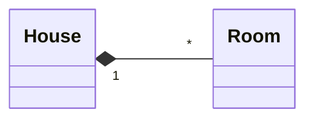
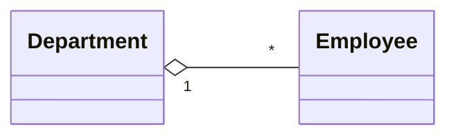
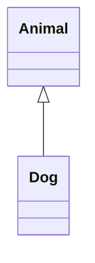
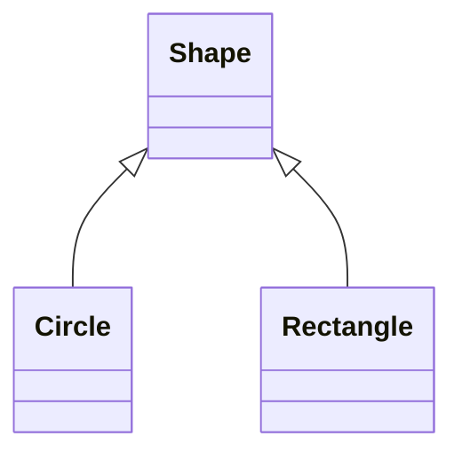
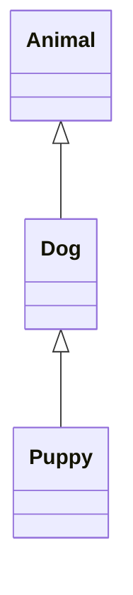
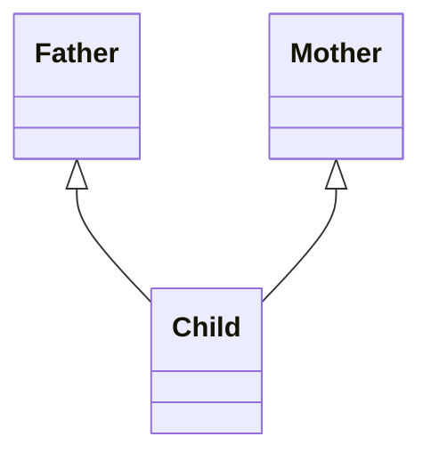

# Chapter 5: Object Oriented Programming

## 5.1 Concepts of Object-Oriented Programming

> **Explain the benefits of object-oriented programming over procedural programming. [6 marks] (2082 Baishakh - IOE)**

**Procedural programming** organizes code as a sequence of instructions grouped into functions that operate on data. Data and functions are separate. Examples: C, Pascal.

**Object-oriented programming (OOP)** organizes code around objects, which are entities that bundle data (attributes) and behavior (methods) together. The program is modeled as interactions between objects. Examples: Python, Java, C++.

**Four pillars of OOP:**

- **Encapsulation:** Bundling data and methods into a single unit (class) and restricting direct access to internal data. Access is controlled through methods (getters/setters) and access modifiers (`_protected`, `__private`). Python uses naming conventions to indicate access levels: `_single_underscore` for protected (should not be accessed outside the class hierarchy) and `__double_underscore` for private (name-mangled by Python to prevent accidental access).
- **Abstraction:** Defining _what_ an object does (the contract) without specifying _how_, hiding complex implementation details and exposing only the essential interface. The parent class declares abstract methods, and the child classes provide concrete implementations. The caller works with the abstract type and does not need to know which concrete class is running behind it.
- **Inheritance:** A child class (derived) acquires attributes and methods from an existing class (parent), promoting code reuse and hierarchical classification. The child can also override inherited methods to provide its own behavior.
- **Polymorphism:** The same method name behaves differently depending on the object's actual type. Objects of different classes can be treated through the same interface, and the correct method is resolved at runtime.

**Encapsulation example:**

```python
class BankAccount:
    def __init__(self, owner, balance):
        self.owner = owner           # public attribute
        self.__balance = balance     # private attribute (name-mangled)

    def deposit(self, amount):
        if amount > 0:
            self.__balance += amount

    def withdraw(self, amount):
        if 0 < amount <= self.__balance:
            self.__balance -= amount
        else:
            print("Insufficient funds")

    def get_balance(self):           # getter method
        return self.__balance

acc = BankAccount("Ram", 1000)
acc.deposit(500)
print(acc.get_balance())       # 1500
acc.withdraw(2000)             # Insufficient funds
# print(acc.__balance)         # AttributeError (private, name-mangled)
print(acc._BankAccount__balance)   # 1500 (name-mangling allows access, but discouraged)
```

Python also supports the `@property` decorator to create clean getter/setter interfaces:

```python
class Temperature:
    def __init__(self, celsius):
        self.__celsius = celsius

    @property
    def celsius(self):               # getter
        return self.__celsius

    @celsius.setter
    def celsius(self, value):        # setter with validation
        if value < -273.15:
            raise ValueError("Temperature below absolute zero")
        self.__celsius = value

    @property
    def fahrenheit(self):            # computed property
        return self.__celsius * 9/5 + 32

t = Temperature(25)
print(t.celsius)         # 25 (uses getter)
print(t.fahrenheit)      # 77.0
t.celsius = 100          # uses setter
# t.celsius = -300       # ValueError: Temperature below absolute zero
```

**Inheritance example:**

```python
class Animal:
    def __init__(self, name):
        self.name = name

    def speak(self):
        return f"{self.name} makes a sound"

class Dog(Animal):               # Dog inherits from Animal
    def speak(self):             # overrides parent method
        return f"{self.name} says Woof!"

d = Dog("Rex")
print(d.speak())     # "Rex says Woof!"
```

**Polymorphism example:**

```python
class Dog:
    def speak(self):
        return "Woof!"

class Cat:
    def speak(self):
        return "Meow!"

# Same interface, different behavior depending on object type
for animal in [Dog(), Cat()]:
    print(animal.speak())    # "Woof!" then "Meow!"
```

**Abstraction example:**

```python
from abc import ABC, abstractmethod

class Shape(ABC):
    @abstractmethod
    def area(self):              # what (contract) -- no implementation
        pass

class Circle(Shape):
    def __init__(self, radius):
        self.radius = radius

    def area(self):              # how (concrete implementation)
        return 3.14 * self.radius ** 2

class Rectangle(Shape):
    def __init__(self, length, breadth):
        self.length = length
        self.breadth = breadth

    def area(self):              # how (different implementation)
        return self.length * self.breadth

# Caller works with the abstract type Shape
# Does not care whether it is Circle or Rectangle
shapes = [Circle(5), Rectangle(4, 6)]
for shape in shapes:
    print(shape.area())          # 78.5 then 24
```

**Benefits of OOP over procedural programming:**

- **Modularity:** Code is organized into self-contained classes, making it easier to develop, test, and maintain.
- **Reusability:** Inheritance allows new classes to reuse existing code without rewriting.
- **Data security:** Encapsulation protects internal state from unauthorized access or accidental modification.
- **Scalability:** OOP designs scale better for large, complex applications.
- **Real-world modeling:** Objects map naturally to real-world entities, making design intuitive.
- **Easier debugging:** Errors are localized within specific objects/classes.

## 5.2 Classes and Objects

> **In object-oriented programming, explain the concept of constructor. Write a python code to illustrate the concept of constructor. Define a class with `__init__()` and `__str__()` methods. [2+4 marks] (2081 Ashwin - IOE)**

A class is a blueprint that defines the structure and behavior of objects. An object is a concrete instance of a class, holding actual data.

```python
class Student:
    pass

s = Student()        # s is an object (instance) of class Student
print(type(s))       # <class '__main__.Student'>
```

### 5.2.1 Attributes and Methods

Attributes are variables that belong to a class or its instances. Methods are functions defined inside a class.

**Instance attributes** are unique to each object, defined in `__init__()` using `self`.

**Class attributes** are shared by all instances, defined directly inside the class body.

**Instance method** is a regular method that takes `self` as its first parameter and can access or modify the instance's attributes.

**Class method** is a method decorated with `@classmethod` that takes `cls` (the class itself) as its first parameter and can access or modify class-level attributes.

**Static method** is a method decorated with `@staticmethod` that takes neither `self` nor `cls` and behaves like a plain function scoped inside the class. It’s basically a utility function grouped inside the class.

```python
class Dog:
    species = "Canis lupus"     # class attribute (shared)

    def __init__(self, name, age):
        self.name = name         # instance attribute (unique)
        self.age = age

    def bark(self):              # instance method
        return f"{self.name} says Woof!"

    @classmethod
    def get_species(cls):
        return cls.species

    @staticmethod
    def get_sci_name():
        return Dog.species

d1 = Dog("Rex", 5)
d2 = Dog("Max", 3)
print(d1.species)           # "Canis lupus"
print(d2.species)           # "Canis lupus"
print(Dog.species)          # "Canis lupus"
print(d1.name)              # "Rex"
print(d2.bark())            # "Max says Woof!"
print(Dog.get_species())    # "Canis lupus"
print(Dog.get_sci_name())   # "Canis lupus"
```

`self` is a reference to the current instance. It must be the first parameter of every instance method. Through `self`, each object accesses its own attributes and methods.

### 5.2.2 `__init__()` and `__str__()` Methods

Dunder methods (double underscore methods) are special methods Python calls automatically in response to built-in operations. You define them to customize how your objects behave.

**`__init__()`** is the constructor, a special method automatically called when an object is created. It initializes the object's attributes. It does not return a value.

**`__str__()`** returns a human-readable string representation of the object. It is called when you use `print()` or `str()` on the object.

```python
class Student:
    def __init__(self, name, roll):
        self.name = name
        self.roll = roll

    def __str__(self):
        return f"Student(name={self.name}, roll={self.roll})"

s = Student("Ram", 101)
print(s)          # Student(name=Ram, roll=101)
```

Other useful dunder methods:

- `__repr__()`: Unambiguous string representation for debugging. Called by `repr()` and in the interactive shell.
- `__len__()`: Called by `len()`.
- `__del__()`: Destructor, called when an object is about to be destroyed.

### 5.2.3 Delete Properties and Objects

A **destructor** is a special method that is called when an object is about to be destroyed. In Python, the `__del__()` method serves as the destructor. It is invoked automatically when an object's reference count drops to zero or when the garbage collector reclaims it.

Use `del` to delete attributes or objects. The `__del__()` destructor is called when an object is garbage collected.

```python
class MyClass:
    def __init__(self, value):
        self.value = value

    def __del__(self):
        print(f"Object with value {self.value} is being destroyed")

obj = MyClass(10)
del obj.value        # deletes the attribute
# print(obj.value)   # AttributeError: 'MyClass' object has no attribute 'value'

del obj              # deletes the object, triggers __del__()
```

You can also use `delattr()`:

```python
delattr(obj, 'value')    # equivalent to del obj.value
```

### 5.2.4 Iterator in a Class

> **Write a class `Student` with attributes `name` and `marks`. Implement an iterator in the class that iterates over the marks list.**

To make a class iterable, implement the iterator protocol by defining `__iter__()` and `__next__()` methods.

- `__iter__()`: Returns the iterator object (usually `self`). Called when iteration starts.
- `__next__()`: Returns the next item. Raises `StopIteration` when there are no more items.

```python
class Student:
    def __init__(self, name, marks):
        self.name = name
        self.marks = marks
        self._index = 0

    def __iter__(self):
        self._index = 0      # reset index for re-iteration
        return self

    def __next__(self):
        if self._index >= len(self.marks):
            raise StopIteration
        value = self.marks[self._index]
        self._index += 1
        return value

s = Student("Ram", [80, 90, 85, 70])
for mark in s:
    print(mark)        # 80, 90, 85, 70
```

## 5.3 Aggregation and Composition

> **Write a program demonstrating aggregation and composition. Create a class `Engine` and a class `Car` that contains an `Engine` object. Show how the lifetime of `Engine` depends on `Car` (composition) vs. exists independently (aggregation).**

Both aggregation and composition represent "has-a" relationships between classes. The difference lies in lifetime dependency.

**Composition (strong "owns-a"):** The contained object is created inside the container and cannot exist independently. If the container is destroyed, the contained object is also destroyed.

```python
class Engine:
    def __init__(self, horsepower):
        self.horsepower = horsepower

    def start(self):
        return f"Engine of {self.horsepower}HP started"

    def __del__(self):
        print(f"Engine of {self.horsepower}HP destroyed")

class Car:
    def __init__(self, model, hp):
        self.model = model
        self.engine = Engine(hp)    # Engine created inside Car

    def drive(self):
        return f"{self.model}: {self.engine.start()}"

    def __del__(self):
        print(f"Car {self.model} destroyed")

car = Car("Toyota", 150)
print(car.drive())       # Toyota: Engine of 150HP started
del car
# Car Toyota destroyed
# Engine of 150HP destroyed   (Engine is also destroyed with Car)
```

Here is another example of composition. `House` creates its own `Room` objects internally. The rooms cannot exist without the house.

```python
class Room:
    pass

class House:
    def __init__(self):
        self.rooms = [Room(), Room()]    # Rooms created inside House

h = House()
print(len(h.rooms))   # 2
del h                  # House destroyed, Rooms are also destroyed
```



**Aggregation (weak "has-a"):** The contained object is created independently and passed to the container. It can exist even after the container is destroyed.

```python
class Engine:
    def __init__(self, horsepower):
        self.horsepower = horsepower

    def __del__(self):
        print(f"Engine of {self.horsepower}HP destroyed")

class Car:
    def __init__(self, model, engine):
        self.model = model
        self.engine = engine       # Engine passed from outside

    def __del__(self):
        print(f"Car {self.model} destroyed")

engine = Engine(200)
car = Car("Honda", engine)
del car                   # Car Honda destroyed
print(engine.horsepower)  # 200, Engine still exists independently
```

Here is another example of aggregation. `Department` receives pre-existing `Employee` objects. The employees can outlive the department.

```python
class Employee:
    pass

class Department:
    def __init__(self, employees):
        self.employees = employees

e1, e2 = Employee(), Employee()
dept = Department([e1, e2])
del dept              # Department is destroyed
print(e1)             # Employee still exists independently
```



## 5.4 Inheritance

> **Write python code to explain the concept of Single, Hierarchical and multi-level inheritance. [6 marks] (2081 Ashwin - IOE)**

Inheritance allows a class (child/derived) to acquire attributes and methods from another class (parent/base). The child class can add new features or override inherited ones.

```python
class Parent:
    pass

class Child(Parent):    # Child inherits from Parent
    pass
```

### 5.4.1 Parent and Child Classes

```python
class Animal:
    def __init__(self, name):
        self.name = name

    def speak(self):
        return f"{self.name} makes a sound"

class Dog(Animal):
    def fetch(self):
        return f"{self.name} fetches the ball"

d = Dog("Rex")
print(d.speak())     # "Rex makes a sound" (inherited)
print(d.fetch())     # "Rex fetches the ball" (own method)
print(isinstance(d, Animal))   # True
print(issubclass(Dog, Animal)) # True
```

### 5.4.2 `__init__()` in Child Class

When a child class defines its own `__init__()`, it overrides the parent's constructor. To also initialize the parent's attributes, you must explicitly call the parent's `__init__()`.

```python
class Person:
    def __init__(self, name, age):
        self.name = name
        self.age = age

class Student(Person):
    def __init__(self, name, age, roll):
        Person.__init__(self, name, age)   # call parent constructor
        self.roll = roll

s = Student("Ram", 20, 101)
print(s.name, s.age, s.roll)   # Ram 20 101
```

### 5.4.3 The `super()` Function

`super()` returns a proxy object that delegates method calls to the parent class (next class in the MRO). It is the preferred way to call parent methods.

```python
class Person:
    def __init__(self, name, age):
        self.name = name
        self.age = age

class Student(Person):
    def __init__(self, name, age, roll):
        super().__init__(name, age)    # no need to pass self
        self.roll = roll

s = Student("Sita", 21, 102)
print(s.name, s.roll)    # Sita 102
```

Advantages of `super()` over direct parent call: works correctly with multiple inheritance (follows MRO), no need to hard-code parent class name, and cooperates properly in complex hierarchies.

### 5.4.4 Member Overriding

A child class can override a parent's method or attribute by redefining it with the same name. The child's version takes precedence.

**Method overriding:** A child class can redefine a parent's method with the same name.

```python
class Animal:
    def speak(self):
        return "Some sound"

class Cat(Animal):
    def speak(self):           # overrides parent's speak()
        return "Meow!"

c = Cat()
print(c.speak())     # "Meow!" (child's version)
```

To extend (not fully replace) the parent's method, call `super()` inside the overridden method:

```python
class Cat(Animal):
    def speak(self):
        parent_msg = super().speak()
        return f"{parent_msg} ... actually, Meow!"
```

**Overriding class variables:** A child class can redefine a class variable to give it a different value.

```python
class Animal:
    species = "Animal"

class Cat(Animal):
    species = "Cat"

print(Animal.species)  # Animal
print(Cat.species)     # Cat
```

**Overriding instance variables:** A child class can override instance variables set by the parent in `__init__()`.

```python
class Animal:
    def __init__(self):
        self.name = "Unknown"

class Cat(Animal):
    def __init__(self):
        super().__init__()
        self.name = "Kitty"   # overrides parent's value

c = Cat()
print(c.name)  # Kitty
```

### 5.4.5 Forms of Inheritance

**Single inheritance:** One child inherits from one parent.

```python
class Animal:
    def eat(self):
        return "Eating"

class Dog(Animal):
    def bark(self):
        return "Barking"

d = Dog()
print(d.eat())      # "Eating" (inherited)
print(d.bark())     # "Barking" (own)
```



**Hierarchical inheritance:** Multiple children inherit from a single parent.

```python
class Shape:
    def __init__(self, color):
        self.color = color

class Circle(Shape):
    def __init__(self, color, radius):
        super().__init__(color)
        self.radius = radius

    def area(self):
        return 3.14 * self.radius ** 2

class Rectangle(Shape):
    def __init__(self, color, length, breadth):
        super().__init__(color)
        self.length = length
        self.breadth = breadth

    def area(self):
        return self.length * self.breadth

c = Circle("Red", 5)
r = Rectangle("Blue", 4, 6)
print(c.area())      # 78.5
print(r.area())      # 24
```



**Multilevel inheritance:** A chain of inheritance where A is inherited by B, and B is inherited by C.

```python
class Animal:
    def breathe(self):
        return "Breathing"

class Dog(Animal):
    def bark(self):
        return "Barking"

class Puppy(Dog):
    def weep(self):
        return "Weeping"

p = Puppy()
print(p.breathe())   # from Animal
print(p.bark())      # from Dog
print(p.weep())      # own method
```



**Multiple inheritance:** A child inherits from two or more parents.

```python
class Father:
    def skill(self):
        return "Gardening"

class Mother:
    def talent(self):
        return "Painting"

class Child(Father, Mother):
    pass

c = Child()
print(c.skill())     # from Father
print(c.talent())    # from Mother
```



If both parents define a method with the same name, Python calls the one from the first parent in the inheritance list. To call a specific parent's version, use `ParentClass.method(instance)` directly.

```python
class Father:
    def skill(self):
        return "Gardening"

class Mother:
    def skill(self):
        return "Painting"

class Child(Father, Mother):
    pass

c = Child()
print(c.skill())            # "Gardening" (from Father, listed first)
print(Mother.skill(c))      # "Painting" (explicitly calling Mother's version)
```

**Method Resolution Order (MRO):** In multiple inheritance, Python determines the method lookup order using the C3 linearization algorithm. View it with `ClassName.mro()` or `ClassName.__mro__`.

```python
print(Child.mro())
# [<class 'Child'>, <class 'Father'>, <class 'Mother'>, <class 'object'>]
```

## 5.5 Polymorphism and Dynamic Binding

> **Explain the concept of dynamic binding. Write python code to illustrate concept of abstract class. [2+4 marks] (2082 Baishakh - IOE)**

**Polymorphism** means "many forms". The same method name can have different behaviors depending on the object that invokes it. Python achieves polymorphism through method overriding, duck typing, and operator overloading.

**Dynamic binding** (late binding) means the method to be executed is determined at runtime based on the object's actual type, not the variable's declared type. When you call `obj.method()`, Python looks up the method in the object's actual class at runtime.

```python
class Dog:
    def speak(self):
        return "Woof!"

class Cat:
    def speak(self):
        return "Meow!"

def animal_sound(animal):      # doesn't care about type
    print(animal.speak())      # resolved at runtime

animal_sound(Dog())    # "Woof!"
animal_sound(Cat())    # "Meow!"
```

**Duck typing:** Python does not check the type of an object; it only checks whether the required method exists. "If it walks like a duck and quacks like a duck, it must be a duck."

### 5.5.1 Abstract Class and Concrete Class

An **abstract class** cannot be instantiated directly. It serves as a template that defines methods which subclasses must implement. Created using the `abc` module.

A **concrete class** implements all abstract methods and can be instantiated.

```python
from abc import ABC, abstractmethod

class Shape(ABC):
    @abstractmethod
    def area(self):
        pass

    @abstractmethod
    def perimeter(self):
        pass

    def description(self):          # concrete method (optional)
        return "I am a shape"

# s = Shape()   # TypeError: Can't instantiate abstract class

class Circle(Shape):                # concrete class
    def __init__(self, radius):
        self.radius = radius

    def area(self):
        return 3.14 * self.radius ** 2

    def perimeter(self):
        return 2 * 3.14 * self.radius

c = Circle(7)
print(c.area())           # 153.86
print(c.perimeter())      # 43.96
print(c.description())    # "I am a shape"
```

If a subclass does not implement all abstract methods, it also becomes abstract and cannot be instantiated.

**Decorators** wrap a function to extend or modify its behavior without changing its source code. A decorator is a function that takes another function as an argument, adds some functionality, and returns a new function. The `@decorator` syntax is shorthand for `func = decorator(func)`.

```python
def shout(func):
    def wrapper():
        result = func()
        return result.upper()
    return wrapper

@shout
def greet():
    return "hello"

print(greet())  # HELLO
```

Python uses decorators extensively in OOP. For example, `@abstractmethod`, `@property`, `@staticmethod`, and `@classmethod` are all built-in decorators.

### 5.5.2 Abstract Methods and Abstract Attributes

**Abstract methods** are declared with `@abstractmethod` and have no implementation in the abstract class. Subclasses must provide the implementation.

**Abstract properties** are created by combining `@property` and `@abstractmethod`. Subclasses must implement them as properties.

```python
from abc import ABC, abstractmethod

class Vehicle(ABC):
    @property
    @abstractmethod
    def max_speed(self):
        pass

    @abstractmethod
    def fuel_type(self):
        pass

class Car(Vehicle):
    @property
    def max_speed(self):
        return 200

    def fuel_type(self):
        return "Petrol"

c = Car()
print(c.max_speed)       # 200 (accessed as property, no parentheses)
print(c.fuel_type())     # "Petrol"
```

## 5.6 Operator Overloading in Python

Operator overloading allows user-defined classes to define custom behavior for built-in operators (`+`, `-`, `==`, etc.) by implementing special dunder methods (double underscore methods).

### 5.6.1 Arithmetic Operators

| Operator | Dunder Method  |
| -------- | -------------- |
| `+`      | `__add__`      |
| `-`      | `__sub__`      |
| `*`      | `__mul__`      |
| `/`      | `__truediv__`  |
| `//`     | `__floordiv__` |
| `%`      | `__mod__`      |
| `**`     | `__pow__`      |

**Example: Sum of complex numbers:**

> **Using concept of binary operator overloading, find the sum of complex numbers. Use class called as complex, with two attributes: [real and imaginary]. [6 marks] (2082 Baishakh - IOE)**

```python
class Complex:
    def __init__(self, real, imag):
        self.real = real
        self.imag = imag

    def __add__(self, other):
        return Complex(self.real + other.real, self.imag + other.imag)

    def __str__(self):
        return f"{self.real} + {self.imag}i"

c1 = Complex(3, 4)
c2 = Complex(1, 5)
c3 = c1 + c2           # calls c1.__add__(c2)
print(c3)               # 4 + 9i
```

**Example: Adding Time objects:**

> **Write a program to create a class called Time with attributes (hour, minute and second) to represent time and add time objects and return the result. [6 marks] (2081 Ashwin - IOE)**

```python
class Time:
    def __init__(self, hour, minute, second):
        self.hour = hour
        self.minute = minute
        self.second = second

    def __add__(self, other):
        s = self.second + other.second
        m = self.minute + other.minute + s // 60
        h = self.hour + other.hour + m // 60
        return Time(h % 24, m % 60, s % 60)

    def __str__(self):
        return f"{self.hour:02d}:{self.minute:02d}:{self.second:02d}"

t1 = Time(10, 45, 50)
t2 = Time(3, 30, 25)
t3 = t1 + t2
print(t3)       # 14:16:15
```

### 5.6.2 Bitwise and Shift Operators

| Operator | Dunder Method |
| -------- | ------------- |
| `&`      | `__and__`     |
| `\|`     | `__or__`      |
| `^`      | `__xor__`     |
| `~`      | `__invert__`  |
| `<<`     | `__lshift__`  |
| `>>`     | `__rshift__`  |

```python
class Byte:
    def __init__(self, val):
        if(val > 0b11111111):
            raise ValueError("Only positive 8 bits number is supported")
        self.val = val

    def __or__(self, other):
        return Byte(self.val | other.val)

    def __lshift__(self, offset):
        return Byte(self.val << offset & 0xFF)

    def __str__(self):
        return bin(self.val)

b1 = Byte(0b11111111)
b2 = Byte(0b01010011)
print(b1 | b2)     # 0b11111111

print(b1 << 1)     # 0b11111110
```

### 5.6.3 Comparison Operators

| Operator | Dunder Method |
| -------- | ------------- |
| `==`     | `__eq__`      |
| `!=`     | `__ne__`      |
| `<`      | `__lt__`      |
| `<=`     | `__le__`      |
| `>`      | `__gt__`      |
| `>=`     | `__ge__`      |

```python
class Student:
    def __init__(self, name, marks):
        self.name = name
        self.marks = marks

    def __lt__(self, other):
        return self.marks < other.marks

    def __eq__(self, other):
        return self.marks == other.marks

s1 = Student("Ram", 85)
s2 = Student("Sita", 92)
print(s1 < s2)       # True
print(s1 == s2)       # False
```

### 5.6.4 Assignment Operators

In-place (augmented assignment) operators modify the object in place and return `self`.

| Operator | Dunder Method  |
| -------- | -------------- |
| `+=`     | `__iadd__`     |
| `-=`     | `__isub__`     |
| `*=`     | `__imul__`     |
| `/=`     | `__itruediv__` |

```python
class Counter:
    def __init__(self, value=0):
        self.value = value

    def __iadd__(self, other):
        self.value += other
        return self

    def __str__(self):
        return str(self.value)

c = Counter(10)
c += 5
print(c)       # 15
```

If `__iadd__` is not defined, Python falls back to `__add__` and reassigns the result.

### 5.6.5 Unary Operators

| Operator   | Dunder Method |
| ---------- | ------------- |
| `-obj`     | `__neg__`     |
| `+obj`     | `__pos__`     |
| `abs(obj)` | `__abs__`     |
| `~obj`     | `__invert__`  |

**Example: Vector class with `+`, `==`, and unary `-`:**

> **Write a program that creates a class `Vector` with attributes `x` and `y`. Overload the `+` operator to add two vectors, the `==` operator to compare two vectors, and the `-` (unary) operator to negate a vector.**

```python
class Vector:
    def __init__(self, x, y):
        self.x = x
        self.y = y

    def __add__(self, other):
        return Vector(self.x + other.x, self.y + other.y)

    def __eq__(self, other):
        return self.x == other.x and self.y == other.y

    def __neg__(self):
        return Vector(-self.x, -self.y)

    def __str__(self):
        return f"Vector({self.x}, {self.y})"

v1 = Vector(3, 4)
v2 = Vector(1, 2)

print(v1 + v2)       # Vector(4, 6)
print(v1 == v2)       # False
print(-v1)            # Vector(-3, -4)
print(v1 == Vector(3, 4))   # True
```
